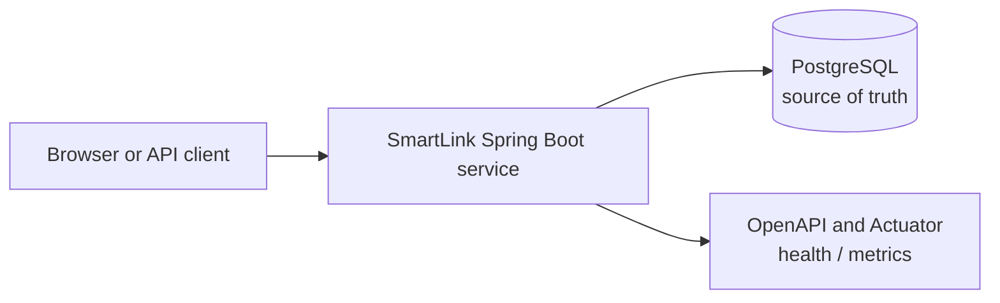
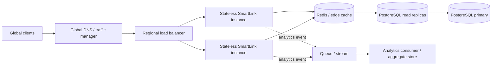
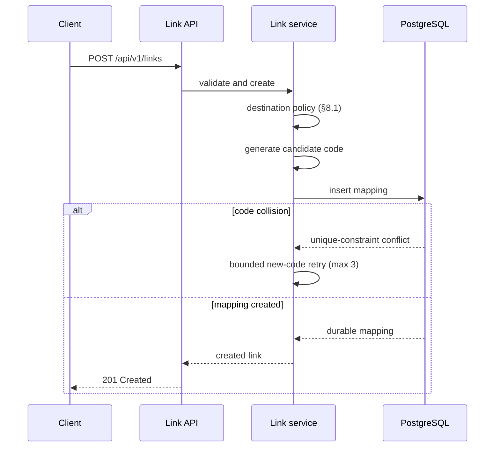
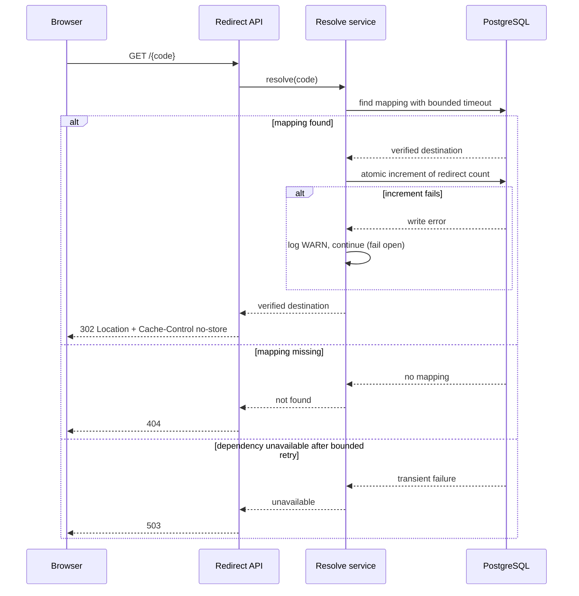

# Greenfield Engineering Specification - SmartLink

**Status:** Approved for implementation
**Scenario:** Greenfield - initial URL-shortener service
**Requirements baseline:** [requirements.md](requirements.md)
**Delivery boundary:** Runnable local prototype plus documented production evolution

## 1. Purpose and scope

This specification translates the Greenfield requirements into an implementation-ready design. It covers the initial SmartLink service: link creation, redirect resolution, basic analytics, safe failures, observability, automated validation, and a local end-to-end runtime.

The prototype deliberately implements the smallest reliable vertical slice. Production-scale caching, replicas, distributed rate limiting, multi-AZ, global routing, asynchronous analytics, and deployment automation are design commitments documented here, not components built in the prototype.

## 2. Engineering decisions

| Area | Decision | Rationale |
|---|---|---|
| Runtime | Java 21, Spring Boot 3, Maven | Mature Java ecosystem and concise, production-oriented application framework. |
| Architecture | Modular monolith | Fast to implement, test, run and reason about; boundaries allow later extraction. |
| Persistence | PostgreSQL with Flyway migrations | Durable system of record, transactional uniqueness, indexed lookup, repeatable schema changes. |
| API style | REST with OpenAPI | Browser/API-client friendly and easy for reviewers to test. |
| Public redirect | Unversioned `GET /{code}` | Shared links remain stable across management-API versions. |
| Management API | Versioned `/api/v1/...` endpoints | Breaking changes can be introduced safely later. |
| Redirect response | `302 Found` with `Cache-Control: no-store` | Every redirect must reach the service, because GF-11 requires a complete redirect count. A cached `301` stops contacting the service and undercounts by an unmeasurable margin. A cached response also cannot be recalled, so `302 → 301` remains available later while the reverse never will. |
| Short-code format | 7 characters, URL-safe Base62 `[A-Za-z0-9]`, cryptographically secure random | 62⁷ ≈ 3.5 × 10¹² keyspace. Length is fixed here rather than left implicit because it determines both collision probability and enumeration resistance. |
| Code generation | `SecureRandom`, never sequential or destination-derived | Sequential codes make the corpus walkable by counting; a destination-derived code leaks whether a URL was shortened before. Under GF-03 and GF-12 the code is the only access control that exists. |
| Analytics | Synchronous total-count update, **fail-open** | Simple, verifiable baseline; async events are the high-volume evolution. Failing a redirect to protect a counter inverts the priority between the product and its instrumentation. |
| Local delivery | Docker Compose | Repeatable application + database startup for a reviewer. |

## 3. Architecture

### 3.1 Prototype architecture - implemented



### 3.2 Production evolution - documented, not implemented



The application node is the **same node** in both diagrams. Statelessness is a property the prototype has today, so horizontal scaling under NFR-06 is a deployment change rather than a rewrite. Every other component above is a design commitment, not a running system.

### 3.3 Component responsibilities

| Component | Responsibility |
|---|---|
| Link API | Validates create requests, invokes the create-link use case, and returns the canonical short URL. |
| Redirect API | Resolves a code, records a successful redirect count, and returns the browser redirect. |
| Analytics API | Returns basic aggregate analytics for a known code. |
| Link application service | Owns use-case orchestration, transaction boundaries, collision handling, and business rules. |
| URL validation policy | Enforces the destination policy in §8.1. Lives in the application core, not the controller, so no alternative entry point can bypass it (NFR-15). |
| Short-code generator | Produces secure URL-safe candidate codes. |
| Link repository | Persists and looks up mappings; database uniqueness is authoritative. |
| Error handler | Maps known conditions to safe Problem Details responses. |
| Operations adapter | Exposes liveness, readiness, health, metrics, and structured logs. |

## 4. API contract

### 4.1 Management API

| Endpoint | Purpose | Success response |
|---|---|---|
| `POST /api/v1/links` | Create a new independent short link. | `201 Created` with link metadata and canonical short URL. |
| `GET /api/v1/links/{code}/analytics` | Retrieve basic analytics. | `200 OK` with code, creation time, destination URL, and total successful redirects. |
| `GET /actuator/health` | Aggregate health check. | `200 OK` when healthy. |
| `GET /actuator/health/liveness` | Process liveness. | `200 OK` while the process is running. Never fails on a dependency outage, or an orchestrator restarts a healthy process during a database blip. |
| `GET /actuator/health/readiness` | Dependency readiness. | `200 OK` only when the database is reachable, so a load balancer stops routing to an instance that cannot serve (GF-13). |

### 4.2 Public redirect API

| Endpoint | Purpose | Success response |
|---|---|---|
| `GET /{code}` | Resolve a public short URL. | `302 Found` with `Location` containing the verified destination URL and `Cache-Control: no-store`. |

**Route precedence.** Application routes are matched before code resolution. `/api/v1/**`, `/actuator/**`, `/v3/api-docs`, and `/swagger-ui**` are reserved and can never be shadowed by an issued code. This is stated rather than left to framework ordering, so a future change to code length or alphabet cannot silently begin capturing operational endpoints.

**Invalid code format.** A syntactically impossible code returns `404`, identical to an unknown code. Distinguishing "malformed" from "not found" would turn the redirect endpoint into a probing oracle.

### 4.3 Request and response examples

```http
POST /api/v1/links
Content-Type: application/json

{
  "destinationUrl": "https://www.example.com/campaign"
}
```

```json
{
  "code": "aB92xK7",
  "shortUrl": "http://localhost:8080/aB92xK7",
  "destinationUrl": "https://www.example.com/campaign",
  "createdAt": "2026-07-30T10:15:30Z"
}
```

```http
GET /api/v1/links/aB92xK7/analytics
```

```json
{
  "code": "aB92xK7",
  "destinationUrl": "https://www.example.com/campaign",
  "createdAt": "2026-07-30T10:15:30Z",
  "totalRedirects": 1432
}
```

### 4.4 Safe error contract

All management API errors use RFC 9457 Problem Details or an equivalent structured JSON response. Error bodies include `status`, a stable public `code`, a safe `detail`, and a correlation-friendly `requestId`. They never include stack traces, database connection details, credentials, or internal hostnames, and never echo user-supplied input in unescaped form.

| Condition | HTTP | Public code | Safe message |
|---|---:|---|---|
| Malformed request body or syntax | 400 | `MALFORMED_REQUEST` | The request could not be parsed. |
| Destination rejected by policy | 422 | `INVALID_URL` | The destination URL is invalid or unsupported. |
| Unknown short code | 404 | `LINK_NOT_FOUND` | This short link does not exist. |
| Customer-facing rate limit *(production only - not implemented in prototype)* | 429 | `RATE_LIMITED` | Too many requests. Please try again later. |
| Required dependency unavailable, or short-code allocation exhausted its attempts | 503 | `SERVICE_UNAVAILABLE` | The service is temporarily unavailable. Please try again later. |
| Unexpected failure | 500 | `INTERNAL_ERROR` | An unexpected error occurred. |

Three distinctions in this table carry operational weight:

- **400 versus 422.** A request that cannot be parsed is `400`. A well-formed request whose destination is rejected by policy is `422` - the server understood it perfectly and declined it. Collapsing both into `400` tells a caller nothing about whether retrying with a corrected URL is worthwhile.
- **503 versus 500.** `503` means come back; `500` means someone needs to look at this. Collapsing them destroys the signal that decides whether an alert is warranted.
- **Collision exhaustion returns 503, not 500.** Nothing is broken - the allocation attempts were consumed and the request is safely retryable.

## 5. Data model and consistency

### 5.1 Initial schema

```text
short_link
----------
id                  bigserial, primary key
short_code          varchar(16), NOT NULL, UNIQUE, indexed
destination_url     varchar(2048), NOT NULL
created_at          timestamp with time zone, NOT NULL
total_redirects     bigint, NOT NULL, default 0
```

No column can hold personal data. NFR-13 is enforced by schema rather than by discipline: there is nowhere to put an IP address, so no future code can start storing one without a migration a reviewer would see.

`varchar(16)` against a 7-character format leaves room for a format change without a type migration, at no cost.

**There is deliberately no `version` column.** An optimistic-lock version on this table would be actively harmful: `total_redirects` is written on *every* redirect, so a load-modify-save cycle guarded by `@Version` makes two concurrent redirects of the same link collide, and one fails or retries. The failure rate would rise with popularity - precisely inverting NFR-08. The counter is updated by an atomic statement instead (§5.2).

### 5.2 Correctness rules

- The unique constraint on `short_code` is the final authority for collision prevention.
- A short code maps to exactly one destination, and is never reassigned to a different one (GF-19).
- A duplicate destination URL may receive a different short code because each creation request represents an independent link (GF-04). No lookup by destination occurs anywhere in the create path - that absence is what satisfies GF-04.
- Create-link work is transactional: the response is returned only after a valid mapping is durable.
- The redirect count is incremented only after the mapping is resolved as valid.
- **The increment is a single atomic statement** - `UPDATE short_link SET total_redirects = total_redirects + 1 WHERE id = ?` - never a read-modify-write. Concurrent redirects of one link therefore neither lose counts nor contend on an application-level lock.
- **The increment fails open.** If it fails, the failure is logged at WARN and the redirect is still served. The redirect is the product; the counter is instrumentation. Blocking a user from a page that works, in order to protect a number, serves nobody.
- The redirect response must never use a guessed or partially read destination.

### 5.3 Concurrency and collision policy

1. Generate a random candidate code.
2. Attempt to persist the link with the database unique constraint.
3. If a uniqueness conflict occurs, generate a new candidate code and retry up to three total candidates.
4. If all attempts collide, return `503 SERVICE_UNAVAILABLE` and record an operational error.
5. Concurrent requests are safe because persistence, not an in-memory pre-check, enforces uniqueness.

A pre-check would be a race, not a slower correct answer: two requests can both observe a code as free before either inserts. Letting the unique index arbitrate makes the collision impossible rather than unlikely.

The collision allowance is kept separate from the transient-failure allowance in §7.1, so a genuine database outage cannot consume the collision budget.

## 6. Core workflows

### 6.1 Create-link flow



### 6.2 Redirect flow



The fail-open branch is the architecturally significant one and is **invisible in the code** - it reads as an ordinary try/catch. It is therefore enforced by a fault-injection test (§10), not by review convention, because conventions do not survive refactors.

## 7. Resilience, scalability, and caching design

### 7.1 Prototype controls - implemented

- Use bounded database connection and query timeouts configured outside source code.
- Retry only known transient dependency failures, once after the initial request, with short jittered backoff.
- Do not retry invalid input, not-found conditions, or non-transient database errors.
- Do not retry redirect resolution indefinitely; return `503` when a verified mapping cannot be obtained.
- Expose liveness and readiness information.
- Return safe error responses and include a request ID in logs and error responses.

**Retry allowances are asymmetric by design**, because the two paths have different failure economics:

| Path | Transient-failure retries | Collision retries |
|---|---|---|
| Redirect | 1, jittered | n/a |
| Create | 1 | 3 candidate codes |

The redirect cap is a load-shedding decision as much as a resilience one. That path carries the entire load, so three retries per request during a database outage amplify load against an already-failing dependency, hold application threads for the duration, and delay the `503` a client needs in order to fail fast. Jitter is not cosmetic: without it every in-flight request retries at the same instant, and the retry becomes a synchronised herd.

### 7.2 Production evolution - documented

| Workload / failure signal | Evolution decision |
|---|---|
| Redirect latency or datastore read load exceeds target | Add Redis read-through cache. |
| Newly created link is immediately requested | Write-through or immediately populate cache after primary write to avoid replica lag. |
| Cache miss | Read from read replica; use controlled primary fallback when appropriate. |
| Repeated invalid code requests | Use short-lived negative caching and rate limiting. |
| Cache stampede | Single-flight refresh, bounded lock/wait, or serve safe stale value where valid. |
| Hot link receives disproportionate traffic | Cache replication/partitioning and CDN/edge caching. |
| Analytics update affects redirect latency | Publish an asynchronous analytics event and aggregate outside the redirect path. |
| One instance cannot meet peak throughput | Add stateless replicas behind a health-aware load balancer. |
| Regional outage exceeds business tolerance | Add multi-AZ first; consider multi-region recovery based on business RTO/RPO. |

Each row names the evidence that would justify the work. That is what keeps this a scale plan rather than a wish list - nothing here is built because it sounds advanced.

**One caveat that constrains the order of adoption:** once a cache exists, a stale entry *is* a wrong redirect, and NFR-02 stops being free. TTL becomes a correctness bound rather than a performance knob. Cache must therefore be introduced before read replicas, not after - the write-through row above is what prevents a just-created link being served a false `404` by a lagging replica.

## 8. Security, privacy, and secure AI usage

### 8.1 Destination validation policy

A URL shortener is an **open redirector by construction** - that is the product, not a defect. Validation cannot aim to stop redirection; it bounds *what can be redirected to*, and *what a submitted string can do to the service on its way through*.

The policy lives in the application core, not the controller (NFR-15). A rule enforced at the transport boundary is bypassed by the next entry point added - a batch import, a message consumer, an admin path. A rule enforced in the domain type cannot be.

The pipeline runs in a fixed order, and **the order is load-bearing: normalise first, then decide.** A validator that decides before normalising is inspecting a string the rest of the system will never see.

```text
raw input
  │
  ├─▶ length bound              reject oversized before any parsing work
  ├─▶ control-character scan    reject CR, LF, NUL, raw tab
  ├─▶ RFC 3986 parse            reject unparseable
  ├─▶ scheme allowlist          http | https only
  ├─▶ host normalisation        IDN, percent, numeric forms → canonical
  ├─▶ resolve + address check   every resolved address must be public
  └─▶ accept → store verbatim
```

| Control | Rule | Requirement |
|---|---|---|
| Scheme | Allowlist `http`, `https`. Reject `javascript:`, `data:`, `file:`, `vbscript:`, `blob:`, and anything not listed | GF-14 |
| Address ranges | Reject loopback, private, link-local, multicast, reserved, unspecified, and **cloud metadata** (`169.254.169.254`) | GF-15 |
| Notation | Reject blocked addresses in decimal, octal, hexadecimal, mixed, IPv6-mapped, and credential-embedded forms | GF-16 |
| Length | Destination ≤ 2048 characters; code path segment ≤ 16. Checked before parsing | GF-17 |
| Control characters | Reject CR, LF, NUL, raw tab | GF-18 |
| Integrity | Validate once at creation; store byte-identical; redirect trusts the store | GF-19 |
| Fail closed | Unparseable, unresolvable, or ambiguous input is rejected, never accepted | NFR-16 |

**Why an allowlist, never a denylist.** A denylist is a bet that every dangerous scheme was enumerated, against an attacker who needs only one that was missed.

**Why address ranges matter even though nothing fetches destinations yet.** `http://169.254.169.254/` is well-formed and uses an allowed scheme, so a scheme-and-length policy admits it. It is the cloud instance-metadata endpoint, and on an unhardened instance it serves role credentials. The exposure becomes live the moment any server-side component fetches a destination - link preview, title enrichment, safety scanning, availability checking, all natural next features. Validating at creation costs almost nothing now and is expensive to retrofit later, because by then the stored corpus already contains the bad rows.

**Why notation matters.** All of these are the same address:

| Notation | Form |
|---|---|
| Decimal | `http://2852039166/` |
| Octal | `http://0251.0376.0251.0376/` |
| Hexadecimal | `http://0xA9FEA9FE/` |
| IPv6-mapped | `http://[::ffff:169.254.169.254]/` |
| Credential-embedded | `http://expected.com@169.254.169.254/` |

The last is the most dangerous, because it reads as a legitimate host to a human reviewer and to any substring check: everything before `@` is userinfo and is discarded by the parser. The authority component **after** any `@` is the host, and that is what must be evaluated. Every resolved address is checked, not merely the first - a hostname with one public and one private A record passes a first-address-only check.

**Why control characters are the redirect-specific control.** The destination is written into a `Location` **response header**. A value carrying `%0d%0a` that is decoded before being written can terminate that header and inject others - a response-splitting primitive that can forge a body or poison an intermediary cache. Two independent defences, because either alone is a single point of failure: reject at creation, and emit the header only through the framework's header API, never by string concatenation.

**Accepted limitation - time-of-check to time-of-use.** DNS is validated at creation. A hostname can be re-pointed at a private address afterwards, so a destination valid on Monday can be hostile on Tuesday. There is no fix at creation time; only re-validation at fetch time, by whichever component eventually fetches. Since no such component exists yet, this is recorded as a **binding constraint on the first feature that introduces one**, not claimed as solved. Claiming SSRF is closed when only half the window is covered would be worse than stating the gap.

**Deliberately not attempted:** homograph and confusable-domain detection. That is a phishing control rather than an injection control, and a partial implementation gives false assurance.

### 8.2 Other security controls

- Use parameterized persistence through the data-access layer; never concatenate user input into query text, log statements, or response headers (NFR-14).
- Use safe error handling; never render user-supplied input as executable content.
- **Do not log destination URLs at INFO or below.** They are attacker-controlled and routinely carry credentials in query strings - password-reset tokens, signed URLs, session identifiers. Logging them reproduces those secrets into every log sink, backup, and aggregation pipeline the service touches. This is a broader exposure than the error-response rule, and more persistent.
- Keep configuration and credentials outside source control.
- Treat public anonymous link creation as a prototype boundary; production requires authentication, authorization, quotas, rate limiting, and abuse controls.

### 8.3 Privacy boundary

The prototype records aggregate redirect totals only. It does not store IP address, location, browser, device, referrer, or other personal data. This is enforced by the schema (§5.1), not by convention.

### 8.4 Secure AI usage

- Do not provide credentials, tokens, private code, production URLs, customer data, or personal data to AI tools.
- Use synthetic URLs and local configuration examples in AI prompts.
- Verify that every AI-suggested dependency exists, is maintained, and carries a compatible licence before adoption. Hallucinated and typosquatted packages are a documented supply-chain vector against AI-assisted development.
- Treat AI-generated output as untrusted until it is reviewed, tested, scanned, and explicitly approved by the engineer. Generated code reflects common patterns in training data, which includes common vulnerabilities; plausibility is not correctness.

## 9. Observability and SLI/SLO design

### 9.1 Signals

| Signal | Measurement |
|---|---|
| Redirect availability | Successful eligible redirect responses divided by eligible redirect requests. |
| Redirect latency | Server-side redirect duration, reported at p50/p95/p99. |
| Create latency | Create-link duration, reported at p50/p95. |
| **Server error rate** | **5xx responses divided by total requests.** |
| Client error rate | 4xx responses, tracked separately as a **product** signal, never as a reliability signal. |
| Dependency health | Database readiness and connection/query failure indicators. |
| Capacity indicators | Request rate, active connections, and cache hit rate when cache is introduced. |

**4xx is excluded from the reliability SLI on purpose.** A `404` for an unknown code is correct behaviour, not a failure. Folding 4xx into the error rate would make the SLI unusable: a burst of scanner traffic against random codes would breach the objective while the service is working exactly as designed. Tracked separately it is still useful - a rising 404 rate may indicate a broken campaign link or an enumeration attempt - but it measures the product, not the service.

### 9.2 Proposed production objectives

| Objective | Proposed target | Prototype interpretation |
|---|---|---|
| Redirect availability | 99.9% monthly for eligible requests | Design target; not proven by local execution. |
| Redirect latency | p95 under 100 ms under agreed workload | Measure locally and report environment limits. |
| Create latency | p95 under 250 ms under expected write workload | Measure locally and report environment limits. |
| Server error rate | Below 0.1% over SLO window | Validate safe error mapping, not production-scale reliability. |

These are design targets and discussion points, not contractual SLAs. A prototype on a laptop proves none of them, and every measurement is reported with machine, JVM, container runtime, co-location, and sample size stated, with no extrapolation.

## 10. Testing and validation strategy

| Test type | Scope | Required prototype evidence |
|---|---|---|
| Unit | URL policy, code generator, collision logic, service rules, error mapping | JUnit tests. |
| Component / integration | Repository behavior, migrations, unique constraint, transaction behavior | Spring integration tests; Testcontainers if practical. |
| API / contract | Request validation, status codes, Location header, `Cache-Control`, error response structure | Controller tests plus OpenAPI contract. |
| Acceptance / end-to-end | Create → redirect → analytics; invalid URL; unknown code | Documented smoke test with expected results. |
| Concurrency | Parallel creation verifies no conflicting short-code mapping; parallel redirects of one link lose no counts | Focused integration tests. |
| Resilience | Simulated datastore failure maps to safe 503; analytics failure still redirects; health behavior | Targeted fault-injection tests. |
| Performance | Seed links and run bounded local redirect load | Record request count, p50/p95, error rate, and laptop limits. |
| Security | Dependency, secret, static-analysis, and image scans | Scan outputs or documented execution results. |

### 10.1 Tests that exist to catch a regression nobody would notice

| Test | Asserts | Why a test rather than a convention |
|---|---|---|
| `AnalyticsFailureIT` | Counter write fails → redirect still `302` with correct `Location` | The fail-open posture is invisible in the code. A refactor wrapping resolution and increment in one transaction reverses it, and nothing else would catch that. |
| `DatastoreUnavailableIT` | Database down → `503`, never stale or guessed | "Never redirect wrongly" is a property, and a property is only real when something enforces it. |
| `RetryPolicyTest` | Non-transient failures are not retried; transient ones retry exactly once | The dangerous bug is over-retrying, and it stays invisible until an outage. Assert the upper bound, not merely that a retry happens. |
| `ConcurrentCreateIT` | N parallel creates → N distinct codes, zero conflicts | GF-06. |
| `ConcurrentRedirectIT` | N parallel redirects of one link → count is exactly N | Proves the atomic increment; would fail under a read-modify-write or `@Version` implementation. |
| `ForcedCollisionIT` | Generator stubbed to repeat → insert-and-retry recovers | Probability arguments fail silently; a forced collision does not. |
| `DestinationPolicyTest` | Table-driven over every notation in §8.1 - decimal, octal, hex, mixed, IPv6-mapped, credential-embedded - each rejected identically to its plain form | GF-16. Encoding-evasion bugs are found by enumeration, not by reasoning; the failure is always a notation nobody considered, so adding one must cost a single line. |
| `HeaderInjectionTest` | A destination containing `%0d%0a` is rejected at creation, **and** no crafted stored value can split the `Location` header | GF-18, asserting both defences independently. |
| `ErrorReflectionTest` | Invalid-destination errors never contain the raw submitted value unescaped | Reflecting attacker input into an error body is how a validation endpoint becomes the XSS vector it was added to prevent. |

### 10.2 Quality gates

```text
1. Compile and unit/component/API tests pass.
2. OpenAPI contract and acceptance smoke path are verified.
3. Static analysis and dependency vulnerability scan run.
4. Secret scan runs before delivery.
5. Container image scan runs if a Docker image is built.
6. Performance and resilience evidence is captured with its limitations.
7. Engineer reviews every AI-assisted change and signs off on the final state.
```

Coverage is a floor, not a target. A high number over weak assertions is worse than a lower number over strong ones, because it converts "we did not check" into "we checked and it was fine".

**Known hole, stated rather than hidden:** the coverage check skips silently when no execution data exists, so with an empty suite it passes vacuously. Tolerable only until T4. From then on, a suite that stops producing execution data is a failure, not a skip.

## 11. Task decomposition and dependencies

| ID | Task | Depends on | Acceptance evidence |
|---|---|---|---|
| T1 | Scaffold project, configuration, local runtime skeleton | None | Application starts and health endpoint responds. |
| T2 | Define OpenAPI contracts and error model | T1 | Contract reviewed; sample requests/responses present. |
| T3 | Add database schema and migrations | T1 | Migration applies to clean database. |
| T4 | Implement domain model, URL policy, and code generation | **T1** | Unit tests for rules and candidate generation, with no Spring context and no database. |
| T5 | Implement create-link use case with collision handling | T3, T4 | Create tests; uniqueness/concurrency evidence. |
| T6 | Implement redirect resolution and analytics count | T4, T5 | Redirect, not-found, analytics, fail-open and atomic-increment tests. |
| T7 | Implement safe errors, health, logging, and timeout settings | T1, T5, T6 | Safe-error and dependency-failure tests. |
| T8 | Add API/component/acceptance tests | T5, T6, T7 | Automated test suite passes. |
| T9 | Add quality/security scans and performance/resilience checks | T8 | Results captured and reviewed. |
| T10 | Complete Docker Compose, README, scenario validation, and final review | T8, T9 | Fresh-start smoke test succeeds. |

**T4 depends only on T1.** The domain layer is the innermost layer: it imports no framework and performs no I/O, so it depends on neither the OpenAPI contract nor the schema. Making it wait on T2 and T3 would delay the most valuable and most exhaustively testable work in the project behind unrelated scaffolding. T2, T3 and T4 run in parallel.

Full task envelopes - intent, constraints, acceptance criteria, technical context - in [task-decomposition.md](task-decomposition.md).

## 12. Traceability and engineer approvals

| Requirements area | Implementation evidence | Approval gate |
|---|---|---|
| Link creation and uniqueness | Create service, unique migration, concurrency tests | Engineer verifies code collision and race behavior. |
| Redirect correctness | Redirect service and controller tests | Engineer verifies no path emits an unverified redirect. |
| Destination validation | URL policy, notation table tests, header-injection tests | Engineer verifies every notation in §8.1 is covered. |
| Analytics correctness | Atomic increment, concurrent redirect test, fail-open test | Engineer verifies a counter failure cannot fail a redirect. |
| Safe failures | Exception handler, timeout config, resilience tests | Engineer reviews all public error messages. |
| Customer-facing quality | Health, logs, OpenAPI, Docker instructions | Engineer verifies fresh-start and smoke test. |
| Security | Validation, scan results, secret handling | Engineer reviews findings and records rationale. |

## 13. AI-assisted implementation plan

AI is used as a bounded accelerator, not as the decision maker.

| Activity | AI may assist with | Engineer retains ownership of |
|---|---|---|
| Requirement review | Ambiguity and edge-case identification | Assumptions, scope, and final requirements. |
| Implementation | Scaffolding, focused code alternatives, refactoring suggestions | Architecture, secure design, correctness, and merge decision. |
| Test design | Edge cases and test-case drafts | Test adequacy, assertions, and execution results. |
| Documentation | Clarity and completeness review | Factual accuracy and final wording. |
| Review preparation | Risk questions and trade-off framing | Final engineering summary and all claims. |

For every material AI-assisted change, record the task intent, constraints, prompt purpose, accepted output, edits/rejections and rationale, plus validation performed in [ai-assisted-engineering.md](../../ai-assisted-engineering.md).

## 14. Risks, trade-offs, and deferred work

| Decision | Benefit | Accepted trade-off / mitigation |
|---|---|---|
| Modular monolith | Fast, clear delivery | Less independent component scaling; extract only after measured need. |
| PostgreSQL-only prototype | Strong correctness and simple local operation | Redirect reads can become a bottleneck; add cache and replicas after measurement. |
| Synchronous analytics count | Simple, testable baseline | Hot-row contention at scale; the atomic increment removes application-level contention but not row-level write contention. Measured, then moved to asynchronous aggregation. |
| Anonymous creation | Keeps prototype focused | Production abuse risk; require identity, quotas and rate limiting. |
| Single-region scope | Reasonable one-day delivery boundary | Does not address regional outage; document multi-AZ and multi-region evolution. |
| Bounded retries | Handles brief transient faults | Cannot solve a sustained outage; fail quickly and safely with 503. |
| Validation at creation only | Keeps the redirect path fast | Time-of-check-to-time-of-use gap (§8.1); binds the first feature that fetches a destination. |

### 14.1 Risk register

| # | Risk | Severity | Mitigation |
|---|---|---|---|
| R-1 | Destination validation bypassed by a notation not covered in §8.1 | High - SSRF | Normalise before evaluating; table-driven tests over every known notation. |
| R-2 | TOCTOU: a validated hostname is later re-pointed at a private address | High - **not fixable at creation time** | Accepted and documented; binding constraint on the first fetching feature. |
| R-3 | Analytics coupling reintroduced by a later refactor | High - outage from a non-essential path | Fault-injection test in CI, not a review convention. |
| R-4 | Hot-row write contention on a viral link | Medium | Atomic increment removes lock contention; residual row contention measured, not assumed. |
| R-5 | Over-retrying amplifies a database outage | High | One retry on the redirect path, jittered; upper bound asserted by test. |
| R-6 | Secrets leaked via destination query strings in logs | High | Destinations never logged at INFO or below. |
| R-7 | Coverage gate passes vacuously on an empty suite | Medium - false confidence | Noted in build config; load-bearing from T4. |
| R-8 | Homograph / confusable-domain phishing | Medium | **Not addressed.** Phishing control, not injection control; partial implementation would give false assurance. |
| R-9 | Reviewer cannot run it | Medium - the submission fails on its own terms | Clean-clone rehearsal; pinned image tags. |

## 15. Implementation sign-off

Implementation may begin when the engineer confirms:

- The linked requirements are complete enough for the Greenfield scope.
- The decisions, risks, and deliberate non-goals are understood.
- The prototype / production-evolution boundary is explicit.
- Quality gates and required validation evidence are included in the task plan.
- AI use remains bounded, traceable, and subject to engineer review.

**Approved by:** _________________  **Date:** __________
