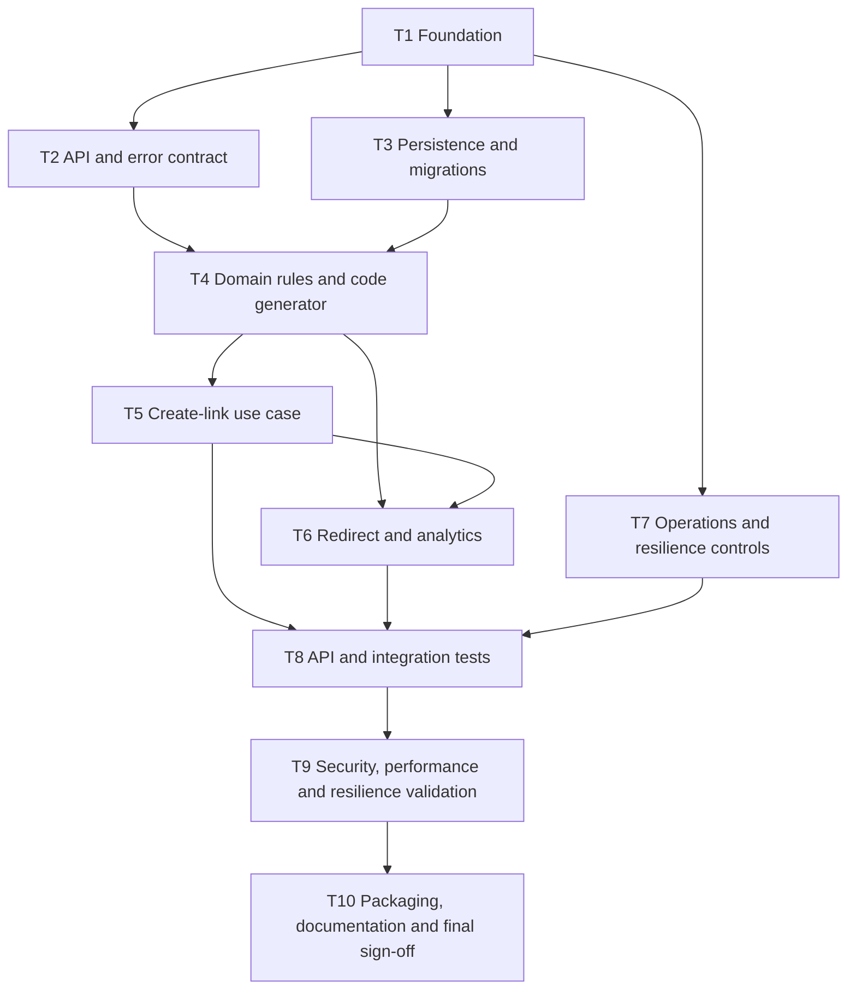

# Greenfield Task Decomposition - SmartLink

**Scenario:** Greenfield
**Source specification:** [engineering-spec.md](engineering-spec.md)
**Requirement baseline:** [requirements.md](requirements.md)
**Execution model:** Engineer-led delivery; AI may accelerate bounded tasks under review.

## 1. Delivery sequence

**Practical note on T4.** The dependency on T2 and T3 is real for the *error-taxonomy* half
of T4 — collision and dependency-failure types must agree with the public error codes T2
defines. It is **not** real for the destination-policy half: that code imports no framework
and performs no I/O, so `Destination`, `ShortCode` and `CodeGenerator` can be written and
fully unit-tested immediately after T1. Starting them in parallel gets the highest
branch-density work under test earliest, which is where defects concentrate.

## 2. Definition of done

A task is complete only when:

- Its acceptance criteria are met.
- Relevant automated checks pass.
- New errors are safe and documented.
- AI-assisted output, if used, has been reviewed and recorded.
- The engineer has reviewed the change against the linked requirements and specification.

## 3. Work items

### T1 - Establish the application foundation

| Field | Detail |
|---|---|
| Intent | Establish a reproducible Spring Boot application baseline and local configuration boundary. |
| Dependencies | None |
| Requirements | NFR-06, NFR-11, NFR-12 |
| Technical context | Java 21, Spring Boot 3, Maven, configuration profiles, Docker Compose target. |
| Tasks | Create project structure; add minimal web, validation, persistence, migration, actuator, OpenAPI and test dependencies; configure local environment variables; add application bootstrap and health endpoint. |
| Acceptance criteria | Application compiles; health endpoint responds; no credential is committed; configuration can be overridden through environment variables; **the application holds no session or link state in process memory**, which is the whole content of NFR-06. |
| AI assistance allowed | Generate dependency/checklist suggestions; review generated build configuration manually. |
| Engineer approval | Confirm dependency set is minimal, version choices are compatible, and configuration contains no secret. **Verify each AI-proposed dependency exists and is maintained** - hallucinated and typosquatted packages are a documented supply-chain vector against AI-assisted development. |
| Validation evidence | Build output, health-check response, `.env.example`, and initial README command. |

### T2 - Define the HTTP API and safe error contract

| Field | Detail |
|---|---|
| Intent | Make the create, redirect, analytics, health, and error behavior explicit before implementation. |
| Dependencies | T1 |
| Requirements | GF-01, GF-02, GF-03, GF-07 through GF-13, NFR-04, NFR-05 |
| Technical context | OpenAPI defines `/api/v1` management endpoints; public redirect remains `GET /{code}`; structured Problem Details responses. |
| Tasks | Define request/response DTOs; document HTTP statuses; define public error codes; establish request ID propagation; publish OpenAPI metadata. |
| Acceptance criteria | API contract includes all Greenfield endpoints; errors reveal no internals; redirect route is unversioned; sample calls are documented. **The 400/422 split** (unparseable vs policy-rejected) **and the 503/500 split** (retryable vs needs-attention) are both present, since collapsing either destroys a signal a caller or an operator acts on. Documentation is **generated from the implementation**, never hand-maintained. |
| AI assistance allowed | Draft DTOs, OpenAPI examples, and error-case matrix; engineer verifies HTTP semantics and public messages. |
| Engineer approval | Review browser redirect semantics, public error content, API versioning rule, and request validation boundaries. |
| Validation evidence | OpenAPI document, controller contract tests, and reviewed API examples. |

### T3 - Build durable persistence and migration baseline

| Field | Detail |
|---|---|
| Intent | Create the authoritative link-mapping store and versioned schema evolution path. |
| Dependencies | T1 |
| Requirements | GF-05, GF-06, GF-19, NFR-01, NFR-13, NFR-14 |
| Technical context | PostgreSQL source of truth; Flyway migration; unique indexed short code; durable creation timestamp and redirect count. |
| Tasks | Model `short_link`; create initial Flyway migration; add unique constraint/index; implement repository methods for creation, lookup and analytics update. |
| Acceptance criteria | A clean database receives the migration; persisted mappings survive restart; duplicate short-code persistence is rejected by the database. **No `version` / optimistic-lock column exists** (see constraint below). The redirect counter is updated by a single atomic statement, never read-modify-write. **No column can hold personal data**, so NFR-13 is enforced by schema rather than discipline. Queries are parameterised (NFR-14). |
| AI assistance allowed | Draft migration/entity mapping; engineer reviews schema naming, constraints, indexes and portability. |
| Engineer approval | Confirm database constraint is the authority for uniqueness and migration is backward-safe for initial release. Confirm no optimistic-lock version was reintroduced by an ORM default. |
| Validation evidence | Migration test, repository integration test, unique-constraint test, concurrent-increment test. |

> **Constraint - no optimistic locking on this table.** `total_redirects` is written on *every*
> redirect. An `@Version`-guarded load-modify-save makes two concurrent redirects of one link
> collide, so the failure rate would rise with the link's popularity - exactly inverting
> NFR-08. This is easy to reintroduce by accident, because adding `@Version` looks like
> diligence. `ConcurrentRedirectIT` (T8) is the executable form of this constraint.

### T4 - Implement domain rules and short-code generation

| Field | Detail |
|---|---|
| Intent | Centralize URL validation, input limits, code generation, and domain error rules. |
| Dependencies | T2, T3 *(destination-policy subset needs only T1 - see §1)* |
| Requirements | GF-01, GF-05, GF-06, GF-10, **GF-14 through GF-19**, NFR-02, NFR-04, **NFR-15, NFR-16** |
| Technical context | HTTP/HTTPS-only destination policy; URL-safe random Base62 candidates, 7 characters; bounded input size; typed domain exceptions. **Zero framework imports in `com.smartlink.domain`**; DNS reached through a domain-owned port so the policy is provable with a stubbed resolver and no network (NFR-15). |
| Tasks | Implement the destination pipeline in spec §8.1 - length bound, control-character scan, RFC 3986 parse, scheme allowlist, host normalisation, resolved-address check. Define maximum allowed input length. Generate secure candidate codes. Define collision and dependency-failure error types. |
| Acceptance criteria | Unsupported schemes and malformed inputs fail validation; candidates use only allowed characters; generated-code tests are deterministic where needed. **Additionally:** private, loopback, link-local and cloud-metadata addresses rejected (GF-15); the same address rejected identically in decimal, octal, hexadecimal, IPv6-mapped and credential-embedded notation (GF-16); CR/LF/NUL/raw-tab rejected (GF-18); over-length rejected before parsing (GF-17); **fail closed** - unparseable, unresolvable or ambiguous input is rejected, never accepted (NFR-16); destinations stored byte-identical, normalisation used for evaluation only (GF-19). |
| AI assistance allowed | Produce edge-case inventory and initial unit-test drafts; engineer checks security policy and test assertions. |
| Engineer approval | Confirm no unsafe scheme passes validation and the generator does not use predictable time-only values. **Confirm normalisation happens before evaluation** - a validator that decides first is inspecting a string the rest of the system never sees, which is how `http://expected.com@169.254.169.254/` passes a substring check. **Confirm every resolved address is checked, not the first** - a host with one public and one private A record defeats a first-address-only check. |
| Validation evidence | Unit tests for URL policy, limits, generated-code format, and error mapping; the notation table in `DestinationPolicyTest`. |

### T5 - Implement the create-link use case

| Field | Detail |
|---|---|
| Intent | Turn a valid destination request into a durable independent short link. |
| Dependencies | T4 |
| Requirements | GF-01 through GF-06, NFR-01, NFR-02, NFR-03 |
| Technical context | Transactional persistence; database-backed uniqueness; up to three candidate-code attempts; bounded transient dependency retry policy. |
| Tasks | Implement application service; persist link; map unique-constraint conflicts to new candidate attempts; return canonical short URL; add create controller. |
| Acceptance criteria | Valid create returns `201`; duplicate destination requests create independent links; no two destinations can share a code; collision retry is bounded; failures are safe. **No lookup by destination occurs anywhere in this path** - that absence is what implements GF-04. Exhausted collision attempts return `503`, not `500`. The 3-candidate collision allowance is separate from the 1-retry transient-failure allowance, so an outage cannot consume the collision budget. |
| AI assistance allowed | Draft service/test structure; engineer reviews transaction boundary, retry conditions and idempotency implications. |
| Engineer approval | Verify collision handling uses database truth, not pre-check logic, and retries do not mask non-transient errors. |
| Validation evidence | Unit, controller, repository, and parallel-create integration tests. |

### T6 - Implement redirect resolution and basic analytics

| Field | Detail |
|---|---|
| Intent | Resolve a code safely, return a standards-compliant redirect, and record basic successful-redirect analytics. |
| Dependencies | T4, T5 |
| Requirements | GF-07 through GF-12, GF-19, NFR-02, NFR-05, NFR-07, NFR-08, NFR-13 |
| Technical context | `GET /{code}` returns `302` with `Location` and `Cache-Control: no-store`; unknown code returns 404; analytics increments after successful resolution; high-scale caching is documented only. |
| Tasks | Implement resolver service; redirect controller; atomic analytics increment; analytics endpoint; not-found mapping; prevent accidental route collision with management APIs. |
| Acceptance criteria | Known code redirects to exactly the registered URL; unknown code never redirects; analytics count reflects successful resolutions; same-client browser behavior is standards compliant. **Additionally: the increment fails open** - a counter write failure is logged at WARN and the redirect is still served (see constraint below). The increment is atomic, so concurrent redirects of one link lose no counts. A **malformed** code returns `404`, identical to an unknown code, so the endpoint is not a probing oracle. |
| AI assistance allowed | Generate controller-test candidates and browser-header edge cases; engineer verifies response status, Location safety and analytics semantics. |
| Engineer approval | Verify no destination is emitted without a verified mapping and redirect does not expose internal information. **Verify the counter cannot fail the redirect**, including under a transaction boundary that spans both. |
| Validation evidence | Controller/integration tests for 302 + Location + Cache-Control, 404, analytics, API-route precedence, fail-open behaviour, and concurrent increment. |

> **Constraint - analytics fails open.** The redirect is the product; the counter is
> instrumentation. Blocking a user from a page that works, in order to protect a number,
> inverts that priority. This posture is **invisible in the code** - it reads as an ordinary
> try/catch - so a well-meaning refactor that wraps resolution and increment in one
> transaction silently reverses it. `AnalyticsFailureIT` (T8) is what keeps it true.

### T7 - Add operational, resilience, and observability controls

| Field | Detail |
|---|---|
| Intent | Make failure states observable and ensure unavailable dependencies produce bounded, safe behavior. |
| Dependencies | T1; integrate with T5 and T6 |
| Requirements | GF-13, GF-18, NFR-02 through NFR-04, NFR-10, NFR-14 |
| Technical context | Actuator liveness/readiness; structured logs; request ID; bounded database timeouts; one transient retry with jitter; 503 after failure. |
| Tasks | Configure health indicators; add request ID/filter; implement exception handler; externalize timeout/retry configuration; add safe dependency-failure mapping; ensure error logging avoids full destination URLs. |
| Acceptance criteria | Health endpoints distinguish readiness/liveness; datastore failure produces 503; public response is safe; logs carry request context without sensitive values. **Liveness must not fail on a dependency outage** - otherwise an orchestrator restarts healthy processes during a database blip and converts a recoverable failure into a self-inflicted outage. **Destination URLs are not logged at INFO or below**, because query strings routinely carry reset tokens, signed URLs and session identifiers. `Location` is emitted through the framework header API, never string concatenation (GF-18, NFR-14). |
| AI assistance allowed | Suggest failure scenarios and log-field checklist; engineer reviews all data captured in logs and retry policy. |
| Engineer approval | Confirm retry is bounded and only transient errors are retried; confirm no unsafe redirect after dependency failure. **Assert the upper bound on retries, not merely that a retry occurs** - the dangerous bug here is over-retrying, and it stays invisible until an outage, at which point retries amplify load against a failing dependency and delay the 503 a client needs to fail fast. |
| Validation evidence | Health tests, simulated repository failure test, safe-error response test, log-assertion test. |

### T8 - Build the automated test suite and acceptance path

| Field | Detail |
|---|---|
| Intent | Validate the complete Greenfield behavior through layered tests and an end-to-end smoke path. |
| Dependencies | T5, T6, T7 |
| Requirements | All functional requirements; NFR-11 |
| Technical context | JUnit 5; Mockito for unit tests; Spring MVC/controller tests; PostgreSQL integration tests; Testcontainers if local setup permits. |
| Tasks | Complete unit/component/API/contract/concurrency/resilience tests; define smoke-test script; document test command and expected evidence. |
| Acceptance criteria | Required paths pass: create, redirect, invalid input, missing link, analytics, concurrent creation, dependency failure; test suite is repeatable from a clean checkout. The named suite below is present and passing. |
| AI assistance allowed | Generate test matrices and first-pass tests; engineer verifies coverage, fixtures, assertions and false-positive risks. |
| Engineer approval | Review that tests verify behavior rather than only implementation details. |
| Validation evidence | Maven test output, coverage summary, smoke-test transcript. |

**Named tests that exist to catch a regression nobody would otherwise notice.** These are
listed explicitly because each guards a decision that is invisible in the code it protects:

| Test | Guards |
|---|---|
| `AnalyticsFailureIT` | Fail-open. A refactor wrapping resolution and increment in one transaction reverses it silently. |
| `ConcurrentRedirectIT` | Atomic increment. Fails under any read-modify-write or `@Version` implementation - the executable form of the T3 constraint. |
| `DatastoreUnavailableIT` | 503, never stale or guessed. "Never redirect wrongly" is a property, and a property is only real when something enforces it. |
| `RetryPolicyTest` | Retry **upper** bound, and that non-transient failures are not retried. |
| `ConcurrentCreateIT` | GF-06 - N parallel creates yield N distinct codes. |
| `ForcedCollisionIT` | Insert-and-retry recovery. Probability arguments fail silently; a forced collision does not. |
| `DestinationPolicyTest` | Table-driven over every notation in spec §8.1. Encoding-evasion bugs are found by enumeration, not reasoning - adding a notation must cost one line. |
| `HeaderInjectionTest` | Both CRLF defences independently: rejected at creation, **and** unsplittable at emission. |
| `ErrorReflectionTest` | Error bodies never echo raw input, and leak no `jdbc`/`postgres`/stack frames. |

### T9 - Run security, performance, and resilience validation

| Field | Detail |
|---|---|
| Intent | Apply quality gates and capture honest evidence about system behavior and prototype limits. |
| Dependencies | T8 |
| Requirements | NFR-03, NFR-04, NFR-07, NFR-08, NFR-10, NFR-11 |
| Technical context | Dependency scan, secret scan, static analysis, container scan if image is built; bounded local load test; controlled dependency-failure experiment. |
| Tasks | Run scans; triage findings; execute local redirect workload; capture p50/p95/error rate; perform datastore-failure simulation; document limitations and production evolution. |
| Acceptance criteria | No unresolved critical findings without explicit rationale; performance report states environment and load; safe failure behavior is demonstrated or documented with a reproducible method. **Two load scenarios are measured** - spread across many codes, and concentrated on one hot code - because the delta is what quantifies the row contention the design knowingly accepted, converting NFR-08 from a claim into a number. |
| AI assistance allowed | Summarize scan findings and propose investigation questions; engineer verifies every finding and remediation/suppression decision. |
| Engineer approval | Approve security finding disposition and ensure **no performance claim exceeds its evidence**. A laptop measurement is a regression signal, not proof of production capacity. |
| Validation evidence | Scan reports, performance results with machine/JVM/runtime/sample size stated, resilience test notes, and finding decision log. |

> NFR-06 is deliberately absent from this task. Horizontal scalability is established by
> construction in T1 - the read path holds no node-local state - and is not something a
> scan or a single-instance load test can validate. Claiming otherwise would be the kind of
> unevidenced assertion this task exists to prevent.

### T10 - Package the runnable prototype and prepare final review

| Field | Detail |
|---|---|
| Intent | Make the repository self-explanatory and runnable by a reviewer without relying on chat context or Git history. |
| Dependencies | T8, T9 |
| Requirements | NFR-12 and all acceptance criteria |
| Technical context | Docker Compose app + PostgreSQL; README; final architecture overview; AI traceability; scenario evidence. |
| Tasks | Add Dockerfile and Compose file; write setup/run/test/API examples; complete architecture overview; record AI assistance; execute fresh-start smoke test; final engineer review. |
| Acceptance criteria | A reviewer can start the service, create a link, follow a redirect, view analytics, run tests, and understand assumptions/trade-offs from the repository. `validation.md` traceability matrix is populated from **real results**, and `architecture-overview.md` is promoted from placeholder to final artifact, written from the system that actually got built. |
| AI assistance allowed | Documentation clarity review; engineer verifies every command, link and technical claim by running it. |
| Engineer approval | Final sign-off confirms runnable result, quality-gate evidence, accurate limitations, and no unreviewed AI output. |
| Validation evidence | Fresh-checkout / fresh-start runbook result, README review, final summary. |

## 4. Parallelization guidance

| Parallel work | Constraint |
|---|---|
| T2 API contract and T3 schema work | Both can start after T1, but agree on link fields before finalizing DTOs. |
| T4 destination policy | Can start immediately after T1. It imports no framework and does no I/O, so it depends on neither the contract nor the schema. Only T4's error-taxonomy half needs T2. |
| T7 operations controls | Can start from T1 and be integrated into T5/T6 as they are completed. |
| Documentation skeleton | Can start immediately, but all commands and claims must be re-validated in T10. |
| T8 test structure | Can begin alongside T5/T6, but final acceptance suite requires their completed behavior. |

## 5. High-impact approval gates

| Gate | Engineer must explicitly approve before proceeding |
|---|---|
| G1 - Contract | API routes, redirect semantics, error codes, anonymous-access boundary. |
| G2 - Data correctness | Schema, unique constraint, collision policy, concurrency behavior, **absence of optimistic locking on the counter**. |
| G3 - Public safety | URL validation **including every notation in spec §8.1**, safe error behavior, logging/privacy boundary, timeout/retry policy. |
| G4 - Delivery | Security finding dispositions, test/performance evidence, documented limitations, final repository contents. |

## 6. Requirement coverage

Every requirement is claimed by at least one task. A requirement claimed by none is unbuilt;
a task claiming none is scope creep. This table is the mechanical check on both.

| Requirement | Task |
|---|---|
| GF-01, GF-02 | T2, T4, T5 |
| GF-03 | T2 (absence of auth) |
| GF-04 | T5 |
| GF-05, GF-06 | T3, T4, T5 |
| GF-07, GF-08 | T2, T6 |
| GF-09 | T2, T6 |
| GF-10 | T4 |
| GF-11, GF-12 | T2, T6 |
| GF-13 | T2, T7 |
| GF-14 … GF-17 | T4 |
| GF-18 | T4, T7 |
| GF-19 | T3, T4, T6 |
| NFR-01 | T3, T5 |
| NFR-02 | T4, T5, T6, T7 |
| NFR-03 | T5, T7, T9 |
| NFR-04 | T2, T4, T7, T9 |
| NFR-05 | T2, T6 |
| NFR-06 | T1 - stateless by construction; not validatable by scan or single-instance load test |
| NFR-07, NFR-08 | T6, T9 measured · spec §7.2 documented |
| NFR-09 | spec §8.2 - documented, not implemented, per requirements §6 |
| NFR-10 | T7, T9 |
| NFR-11 | T1, T8 |
| NFR-12 | T1, T10 |
| NFR-13 | T3, T6 |
| NFR-14 | T3, T7 |
| NFR-15, NFR-16 | T4 |

## 7. AI traceability template

Record material AI use in [ai-assisted-engineering.md](../../ai-assisted-engineering.md)
using this format:

| Task | Intent and constraints supplied to AI | Output used | Engineer edit/rejection and rationale | Validation | Approval |
|---|---|---|---|---|---|
| Example: T4 URL validation | HTTP/HTTPS only; reject unsafe schemes; no production URLs in prompt. | Edge-case test list. | Rejected suggestion to allow `ftp`; not in requirement. | Unit tests pass. | Engineer approved. |

Each entry also carries a class - `GENERATED`, `EDITED` or `REJECTED`. **A ledger with no
rejections is evidence that review was not happening**, so rejections are recorded with more
care than acceptances: they are the strongest available proof that judgment was applied
rather than output accepted.
