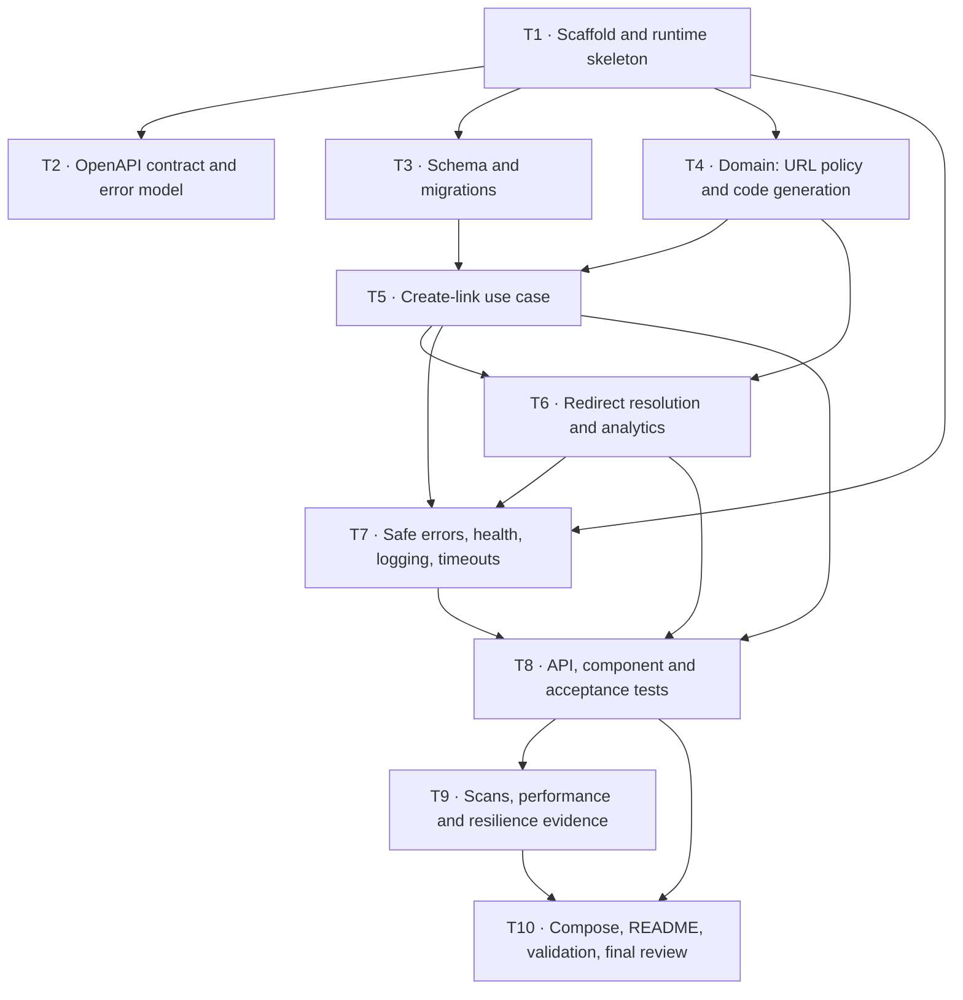

# Greenfield Task Decomposition

Full envelopes for the task table in [engineering-spec.md](engineering-spec.md) §11. Every
task carries **intent, constraints, acceptance criteria and technical context** — the
envelope used to dispatch work. Open-ended instructions are not used: they transfer design
authority away from the engineer and produce output with no stated criterion to check against.

Tasks are sized so their diff can be reviewed in one sitting.

- **Requirements:** [requirements.md](requirements.md)
- **Design:** [engineering-spec.md](engineering-spec.md)
- **Status:** Gate C — awaiting approval

---

## Dependency graph

**T2, T3 and T4 run in parallel** once T1 lands. T4 in particular depends only on T1: the
domain layer imports no framework and performs no I/O, so it depends on neither the contract
nor the schema. Sequencing it behind them would delay the most exhaustively testable work in
the project behind unrelated scaffolding.

T5 and T6 are sequential — T6 builds on the persistence path T5 establishes, and racing them
produces conflicts in exactly the interfaces that most need a single author.

---

## T1 — Scaffold, configuration, local runtime skeleton ✅ *complete*

**Intent** A buildable skeleton with every quality gate wired before any logic exists, so the
first line of business code is already governed.
**Constraints** No business logic. Gates must fail on violation, not warn.
**Acceptance** `mvn verify` green · application starts · health endpoint responds · Spotless
rejects misformatted input · coverage gate present.
**Context** `pom.xml`, `SmartLinkApplication`, `application.yml`, `Dockerfile`,
`docker-compose.yml`.
**Outcome** The format gate rejected the first generated Javadoc before a human saw it —
recorded in the ledger as evidence the gate is load-bearing rather than decorative.

---

## T2 — OpenAPI contract and error model

**Intent** The wire contract, agreed before implementations diverge from it.
**Constraints** Documentation is **generated from the implementation**, never hand-maintained
— a hand-written contract drifts silently. Error bodies never carry stack traces, SQL state,
database messages, internal hostnames, or unescaped user input.
**Acceptance** Spec §4 realised: the 400/422 split, the 503/500 split, `LINK_NOT_FOUND`,
`requestId` on every error. Sample requests and responses present and accurate.
**Context** `api/dto/*`, `api/ProblemDetailAdvice`, springdoc configuration.

---

## T3 — Database schema and migrations

**Intent** The `short_link` table per spec §5.1.
**Constraints** Forward-only. Unique index on `short_code`. **No `version` column** — an
optimistic-lock version on a per-redirect counter makes concurrent redirects of one link
collide, so the failure rate would rise with popularity, inverting NFR-08. No column able to
hold personal data (NFR-13). No `NOT NULL` presuming Scenario 02's expiry column is absent.
**Acceptance** NFR-01 · GF-05. Flyway migrates from empty; Hibernate `ddl-auto: validate`
agrees with the migration.
**Context** `src/main/resources/db/migration/V1__create_short_link.sql`.

---

## T4 — Domain: URL policy and short-code generation

**Intent** The rules with the highest branch density in the system, isolated from Spring and
the database so they can be tested exhaustively and fast.

**Constraints**
- **Zero framework imports** in `com.smartlink.domain`. No Spring, no JPA, no I/O.
- DNS resolution reached through a domain-owned port, so the policy is provable with a
  stubbed resolver and no network.
- **Normalise before deciding** (spec §8.1). A validator that decides first is inspecting a
  string the rest of the system never sees.
- Evaluate the authority component *after* any `@`, and check **every** resolved address, not
  the first.
- Fail closed (NFR-16): unparseable, unresolvable or ambiguous input is rejected.
- Store verbatim — normalisation is for evaluation only and never rewrites the stored value.
- `SecureRandom` for code generation; never sequential, never destination-derived.

**Acceptance** GF-14 · GF-15 · GF-16 · GF-17 · GF-18 · GF-19 · NFR-15 · NFR-16, plus the
7-character Base62 format from spec §2.
- Scheme allowlist: `http`/`https` accepted; `javascript:`, `data:`, `file:`, `vbscript:`, `blob:` rejected.
- **Table-driven** rejection across every notation in spec §8.1 — decimal, octal, hex, mixed, IPv6-mapped, credential-embedded — each rejected identically to its plain form.
- Length bounds enforced before parsing.
- CR / LF / NUL / raw tab rejected.

**Context** `domain/Destination`, `domain/ShortCode`, `domain/CodeGenerator`,
`domain/port/HostResolver`.

**Review focus** The notation table. Encoding-evasion bugs are found by enumerating
notations, not by reasoning about them — the failure is always one nobody considered, so
adding a row must cost a single line.

---

## T5 — Create-link use case with collision handling

**Intent** Orchestrate validation, code allocation and durable persistence.
**Constraints** **No lookup by destination anywhere in this path** — that absence is what
satisfies GF-04. Collision resolved by unique-violation retry, never check-then-insert; the
latter is a race, not a slower correct answer. The 3-candidate collision allowance is kept
separate from the 1-retry transient-failure allowance, so an outage cannot consume the
collision budget. Parameterised queries only (NFR-14).
**Acceptance** GF-01 · GF-02 · GF-04 · GF-05 · GF-06 · NFR-01 · NFR-03. Exhausted collisions
return `503`, not `500`. Concurrent creates yield distinct codes with zero conflicts.
**Context** `application/CreateLinkUseCase`, `application/port/LinkRepository`,
`infrastructure/persistence/*`.

---

## T6 — Redirect resolution and analytics count

**Intent** Look up a code, record the redirect, return the destination.

**Constraints**
- The counter is updated by a **single atomic statement**, never read-modify-write.
- **The counter fails open.** A write failure is logged at WARN; the redirect is still served.
- Datastore failure surfaces as `503`, never a guessed or stale destination (NFR-02).
- At most **one** retry, jittered. Never retry not-found or non-transient errors.
- `302` plus `Cache-Control: no-store`.

**Acceptance** GF-07 · GF-08 · GF-09 · GF-11 · GF-12 · GF-19 · NFR-02 · NFR-03 · NFR-05.
Concurrent redirects of one link produce a count of exactly N.
**Context** `application/ResolveLinkUseCase`, `application/ReadAnalyticsUseCase`,
`api/RedirectController`, `api/AnalyticsController`.

**Review focus** The fail-open branch is invisible in the code — it reads as an ordinary
try/catch. T8's fault-injection test is what keeps it true across future refactors.

---

## T7 — Safe errors, health, logging, timeouts

**Intent** Every failure path is safe, diagnosable, and bounded.
**Constraints** Liveness must **not** fail on a dependency outage, or an orchestrator restarts
healthy processes during a database blip. Readiness must. Timeouts configured outside source
code. **Destination URLs never logged at INFO or below** — they routinely carry credentials in
query strings.
**Acceptance** GF-13 · GF-18 · NFR-04 · NFR-14, including a test asserting no destination URL
appears in logs at INFO, and that `Location` is emitted through the framework header API
rather than by string concatenation.
**Context** `api/CorrelationIdFilter`, `infrastructure/resilience/*`, `application.yml`.

**Review focus** The dangerous retry bug is **over**-retrying, and it stays invisible until an
outage — at which point retries amplify load against a failing dependency and delay the `503`
the client needs to fail fast. Assert the *upper* bound, not merely that a retry occurs.

---

## T8 — API, component and acceptance tests

**Intent** Prove the behaviours that would otherwise regress silently.
**Acceptance** NFR-11, and specifically the suite in spec §10.1: `AnalyticsFailureIT`,
`DatastoreUnavailableIT`, `RetryPolicyTest`, `ConcurrentCreateIT`, `ConcurrentRedirectIT`,
`ForcedCollisionIT`, `DestinationPolicyTest`, `HeaderInjectionTest`, `ErrorReflectionTest`.
**Context** `src/test/java/**`.

`ConcurrentRedirectIT` is the one that would fail under a read-modify-write or `@Version`
implementation — it is the executable form of the T3 constraint.

---

## T9 — Scans, performance and resilience evidence

**Intent** Capture evidence with its limitations, rather than claims.
**Constraints** Report machine, cores, JVM, container runtime, co-location and sample size.
**No extrapolated scale claims.**
**Acceptance** Dependency, secret and static-analysis scans run with output retained.
Performance measured in two scenarios — load spread across many codes, and load concentrated
on a single hot code — where the delta quantifies the row contention spec §14 accepts,
converting NFR-08 from a claim into a number.
**Context** `scripts/performance-test/`.

---

## T10 — Compose, README, scenario validation, final review

**Intent** Clean clone → running → verified, in one documented command.
**Acceptance** NFR-12 · acceptance criterion 8. `docker compose up --build` from a clean
clone; `scripts/smoke-test.sh` green; README demo path accurate; `validation.md` traceability
matrix populated from real results; `architecture-overview.md` promoted from placeholder to
the final artifact, written from the system that actually got built.

---

## Requirement coverage

Every requirement is claimed by at least one task. A requirement claimed by none is unbuilt;
a task claiming none is scope creep.

| Requirement | Task |
|---|---|
| GF-01, GF-02 | T5 |
| GF-03 | T2, T5 (absence of auth) |
| GF-04 | T5 |
| GF-05, GF-06 | T3, T5 |
| GF-07, GF-08 | T6 |
| GF-09 | T6 |
| GF-10, GF-14…GF-17 | T4 |
| GF-11, GF-12 | T6 |
| GF-13 | T7 |
| GF-18 | T4, T7 |
| GF-19 | T4, T6 |
| NFR-01 | T3, T5 |
| NFR-02 | T6, T7, T8 |
| NFR-03 | T7, T8 |
| NFR-04 | T2, T7 |
| NFR-05 | T6 |
| NFR-06 | T1 — stateless by construction |
| NFR-07, NFR-08 | T9 measured · spec §7.2 documented |
| NFR-09 | spec §8.2 — documented, not implemented per requirements §6 |
| NFR-10 | T9 · spec §9 |
| NFR-11 | T8 |
| NFR-12 | T10 |
| NFR-13 | T3, T6 |
| NFR-14 | T5, T7 |
| NFR-15, NFR-16 | T4 |

---

## Gate C — approval required

- [ ] Every requirement is claimed by a task, and the coverage table is accurate.
- [ ] Ordering is correct and the parallelism claims hold.
- [ ] Each task is reviewable in one sitting.

**Approved by:** _________________  **Date:** __________
