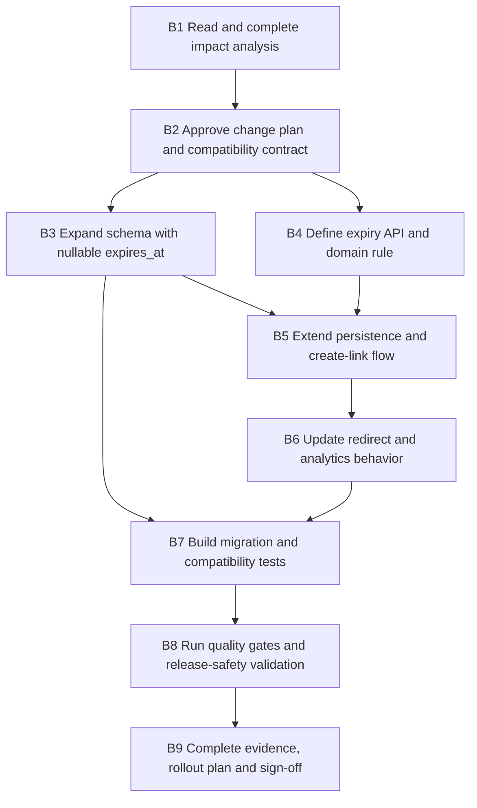

# Scenario 02 — Brownfield · Task Decomposition

**Scenario:** Brownfield — optional link expiration
**Source requirement:** [requirements.md](requirements.md)
**Engineering specification:** [engineering-spec.md](engineering-spec.md)
**Pre-change codebase analysis:** [impact-analysis.md](impact-analysis.md)
**Execution model:** Engineer-led delivery; AI may assist only within an approved task envelope.

> **Status: complete.** Work began after Scenario 01 Gate D and is evidenced in
> [validation.md](validation.md).
> is complete and Brownfield Gate A approves the public `410 Gone` contract, expiry-at-creation
> boundary, and compatibility baseline. Gate C below is the explicit approval to begin code changes.

## 1. Delivery sequence

**Why the order matters.** B3 is an expand-only migration and can safely precede code that
uses it. A rollback to the Greenfield application then ignores the nullable column rather than
failing against a changed schema. B4 can proceed in parallel with B3 after B2, but B5 cannot
use the field until both are complete. The redirect path is deliberately late: it is public,
read-heavy, and must only change after the lifecycle rule, persistence, and compatibility
expectations are proven.

## 2. Definition of done

A task is complete only when:

- Its acceptance criteria and linked requirements are met.
- Its dependency conditions are satisfied.
- Relevant automated checks pass and evidence is recorded in [validation.md](validation.md).
- Any AI-assisted output is reviewed, classified (`GENERATED`, `EDITED`, or `REJECTED`), and
  recorded in [ai-assisted-engineering.md](../../ai-assisted-engineering.md).
- The engineer of record reviews the change against the requirements, specification, and
  backward-compatibility baseline.

## 3. Work items

### B1 — Perform codebase impact analysis

| Field | Detail |
|---|---|
| Intent | Establish the actual Greenfield baseline before changing it; identify every module, API, data flow, test, and operational behavior that the expiration change could affect. |
| Dependencies | Scenario 01 Gate D. |
| Requirements | BC-1 through BC-5; BF-01 through BF-07. |
| Technical context | Read the committed Greenfield code and tests, not recollection. Populate [impact-analysis.md](impact-analysis.md) with exact class, endpoint, migration, and test names. |
| Tasks | Trace create, resolve, analytics, persistence, error mapping, OpenAPI, configuration, and test flows. Identify current public response shapes and route precedence. Record risks and application-rollback behavior. |
| Constraints | Do not modify application code or tests in this task. A failing existing test is evidence, not an invitation to edit it. |
| Acceptance criteria | Every cell in the impact-analysis module table is populated from real code; changed and unchanged data flows are stated; each existing test affected is classified as regression or intentional behavior change; no undocumented public contract change remains. |
| AI assistance allowed | Produce a checklist or candidate search terms only; engineer verifies every affected file and conclusion against the repository. |
| Engineer approval | Confirm the impact analysis is complete enough to define the implementation boundary. |
| Validation evidence | Completed impact analysis, code-navigation notes, and baseline `./mvnw verify` result. |

### B2 — Approve the Brownfield change contract and implementation plan

| Field | Detail |
|---|---|
| Intent | Turn the approved requirement into a safe, reviewable change plan before any migration or public behavior changes. |
| Dependencies | B1; Brownfield Gate A. |
| Requirements | A-11, A-12, A-13; BC-1 through BC-5; BF-01 through BF-07. |
| Technical context | The management API stays at `/api/v1`; `expiresAt` is optional; shared redirect URLs remain unversioned. Expired links return `410 LINK_EXPIRED`, never a redirect. |
| Tasks | Confirm the API field names and response additions; agree the authoritative-clock interface; confirm nullable `expires_at`, expand-contract rollout, no automatic deletion, no cache implementation in scope, and no `/api/v2`. Establish the traceability matrix skeleton. |
| Constraints | No breaking request or response change. Do not add expiry mutation, cleanup jobs, bulk operations, cache, or user interface work. |
| Acceptance criteria | A reviewer can state the new contract, what does not change, rollback behavior, and why a new API version is unnecessary without inspecting Git history. |
| AI assistance allowed | Review wording for hidden breaking changes and enumerate contract-test cases; engineer owns final API semantics. |
| Engineer approval | **Gate C:** approve the decomposition, migration posture, `410` public contract, and test strategy before implementation begins. |
| Validation evidence | Signed Gate A/C decision, reviewed task plan, and requirements-to-task mapping in §6. |

### B3 — Expand the schema safely

| Field | Detail |
|---|---|
| Intent | Introduce storage for an optional expiry without invalidating existing rows or preventing a rollback to the Greenfield application. |
| Dependencies | B2. |
| Requirements | BF-03, BF-04; BC-1, BC-4. |
| Technical context | A forward-only Flyway migration adds nullable `expires_at TIMESTAMP WITH TIME ZONE` to `short_link`. `NULL` means non-expiring. PostgreSQL remains the source of truth. |
| Tasks | Add a new ordered Flyway migration; update only schema fixtures necessary to represent the new column; verify an existing Greenfield database upgrades without data rewrite. |
| Constraints | Do not drop, rename, retype, backfill, or make existing columns non-null. Do not add a destructive down migration. |
| Acceptance criteria | A database at the Greenfield migration version upgrades successfully; legacy rows retain `NULL`; a Greenfield application can run after the migration; schema stores a timezone-aware instant. |
| AI assistance allowed | Draft a migration and migration-test checklist; engineer verifies SQL, ordering, nullability, and production safety. |
| Engineer approval | Confirm this is an expand-only migration and that application rollback remains safe. |
| Validation evidence | Migration integration test, schema inspection, pre-existing-row resolution test, and documented rollback rehearsal. |

### B4 — Define the expiry boundary and additive API contract

| Field | Detail |
|---|---|
| Intent | Make expiry parsing, validation, time semantics, DTO mapping, OpenAPI, and safe errors deterministic before wiring the change into use cases. |
| Dependencies | B2. |
| Requirements | BF-01, BF-02, BF-03, BF-04, BF-06, BF-07; BC-2, BC-3. |
| Technical context | UTC instants only; `expired = expiresAt != null AND now >= expiresAt`; a controlled or injected authoritative clock makes the exact boundary testable. |
| Tasks | Add optional `expiresAt` request/response fields; define validation messages and `INVALID_EXPIRY`; define expiry status representation for analytics; update generated OpenAPI from code. |
| Constraints | Do not accept local-date or timezone-ambiguous values. Do not echo supplied timestamps or destination URLs in unsafe error bodies. Do not break an omitted-expiry request. |
| Acceptance criteria | Valid future UTC expiry is accepted; malformed, missing-zone, and non-future expiry fail with safe `400 INVALID_EXPIRY`; omission preserves Greenfield behavior; OpenAPI documents optionality and `410` behavior. |
| AI assistance allowed | Generate edge-case and contract-test candidates; engineer validates ISO-8601 parsing, UTC semantics, public messages, and generated documentation. |
| Engineer approval | Confirm the exact-boundary rule and additive response contract before use-case wiring. |
| Validation evidence | DTO/domain unit tests, controller contract tests, OpenAPI diff showing no unannounced break. |

### B5 — Extend persistence and create-link behavior

| Field | Detail |
|---|---|
| Intent | Persist a validated optional expiry while retaining the Greenfield creation, collision, and retry guarantees. |
| Dependencies | B3, B4. |
| Requirements | BF-01 through BF-04; BC-1, BC-2, BC-4, BC-5. |
| Technical context | Existing transactional create flow, database-authoritative short-code uniqueness, and bounded retries remain unchanged. The entity/repository maps nullable `expires_at`. |
| Tasks | Extend domain model, entity, repository mapping, create-link use case, response mapping, and tests. Ensure omitted expiry persists as `NULL`; ensure supplied expiry round-trips as the same instant. |
| Constraints | Do not deduplicate destination URLs, alter collision handling, alter retry bounds, or introduce mutation of an existing expiry. |
| Acceptance criteria | Create with no expiry behaves identically to Scenario 01; create with a future expiry returns the documented value; a persisted expiry survives restart; pre-change creation tests pass untouched. |
| AI assistance allowed | Draft mapping and test scaffolding; engineer reviews transaction boundary, null behavior, collision path, and all generated diffs. |
| Engineer approval | Confirm the change does not alter the baseline create-link contract other than the optional field. |
| Validation evidence | Unit, repository integration, controller, and parallel-create regression tests. |

### B6 — Enforce expiry on redirect and expose lifecycle analytics

| Field | Detail |
|---|---|
| Intent | Stop expired links before redirect while preserving correct behavior, low information disclosure, and fail-open analytics for active links. |
| Dependencies | B4, B5. |
| Requirements | BF-04 through BF-07; BC-1, BC-3, BC-5. |
| Technical context | Redirect resolution checks lifecycle after verified lookup and before `Location` emission or analytics increment. Active links retain the existing `302`; expired links return `410 LINK_EXPIRED` with no `Location` header and no successful-redirect increment. |
| Tasks | Add lifecycle decision to resolve use case; map expired outcome to safe error response; extend analytics response with optional expiry and `ACTIVE`/`EXPIRED`; update OpenAPI and route tests. |
| Constraints | Never redirect an expired link; do not change unknown/malformed-code behavior; do not increment analytics for expired attempts; do not make analytics availability gate a valid redirect. |
| Acceptance criteria | Before expiry returns `302`; at the exact expiry instant and later returns `410`; `410` has no `Location`; unknown code remains `404`; analytics exposes expiry/status and does not count expired attempts. |
| AI assistance allowed | Propose lifecycle test matrix and refactor candidates; engineer verifies ordering, headers, counter semantics, and route precedence. |
| Engineer approval | Confirm public redirect behavior and the no-increment invariant against the approved `410` contract. |
| Validation evidence | Controller and integration tests for active, exact-boundary, expired, missing, and malformed-code paths; analytics failure regression test. |

### B7 — Build compatibility, migration, and acceptance evidence

| Field | Detail |
|---|---|
| Intent | Prove that the change works and that the existing service did not silently change. |
| Dependencies | B3, B5, B6. |
| Requirements | BF-01 through BF-07; BC-1 through BC-5. |
| Technical context | Layered JUnit tests, real PostgreSQL integration tests where available, existing Scenario 01 suite executed without modification, and the Brownfield validation matrix as the evidence record. |
| Tasks | Add expiry-domain tests; API/contract tests; migration-upgrade test; legacy-row test; full regression run; end-to-end acceptance flow. Populate all BF and BC rows in [validation.md](validation.md) with test names and real results. |
| Constraints | Do not rewrite Greenfield tests merely to accommodate new behavior. Any unavoidable changed assertion must be recorded in the impact analysis and justified as an approved public behavior change. |
| Acceptance criteria | All BF and BC requirements have at least one named automated proof; Greenfield suite passes unchanged; tests cover omitted, future, invalid, past, exact-boundary, legacy, active, expired, and rollback-after-migration cases. |
| AI assistance allowed | Draft test data and negative cases; engineer verifies assertions prove behavior, especially no `Location` and no analytics increment after expiry. |
| Engineer approval | Review the traceability matrix for missing requirements, weak assertions, and accidental test rewrites. |
| Validation evidence | Passing test output, completed validation matrix, migration proof, and acceptance transcript. |

### B8 — Run quality gates and release-safety validation

| Field | Detail |
|---|---|
| Intent | Validate that the cross-cutting change meets the repository’s build, security, contract, resilience, and performance standards before release documentation is finalized. |
| Dependencies | B7. |
| Requirements | BC-5; quality gates in the Engineering Constitution Article VI. |
| Technical context | `./mvnw verify`; formatting; static analysis; dependency and secret scan; OpenAPI compatibility diff; bounded redirect performance run; controlled datastore-failure test. |
| Tasks | Run and record applicable quality gates; inspect newly introduced dependencies and migration SQL; rerun the active/expired behavior under a controlled clock; perform a local redirect test covering active and expired links; triage findings. |
| Constraints | Do not claim production throughput from a laptop test. No critical security finding may be ignored without an explicit rationale and expiry. Caching, replicas, blue/green deployment, and multi-region failover remain design evolution unless separately approved. |
| Acceptance criteria | All mandatory gates pass or have written, time-bound engineer waivers; no API break is unannounced; dependency outage remains a safe `503` rather than a guessed redirect; performance evidence states method and environment. |
| AI assistance allowed | Summarize scan output and suggest investigation questions; engineer validates every finding, waiver, and conclusion. |
| Engineer approval | Approve security disposition, quality-gate results, and the accuracy of all performance/resilience claims. |
| Validation evidence | Build/scanner reports, OpenAPI diff, resilience notes, performance result, and finding decision log. |

### B9 — Document rollout, rollback, and final Brownfield summary

| Field | Detail |
|---|---|
| Intent | Leave a reviewer with a runnable, defensible Brownfield story that does not depend on commit history. |
| Dependencies | B8. |
| Requirements | BF-01 through BF-07; BC-1 through BC-5; Final Engineering Summary deliverable. |
| Technical context | Document expand-migrate-contract rollout, application rollback after migration, API compatibility, validation evidence, limitations, and future cache/retention evolution. |
| Tasks | Complete impact analysis and validation results; update architecture/API/decision documentation where behavior changed; update README and final engineering summary; record AI ledger entries; perform final reviewer walkthrough. |
| Constraints | Documentation must distinguish implemented behavior from planned production evolution. It must not require a reviewer to inspect Git history, uncommitted files, or this chat. |
| Acceptance criteria | A reviewer can understand the original request, impact, public contract, dependency sequence, migration safety, rollback posture, tests, risks, trade-offs, and limitations from repository documentation alone. |
| AI assistance allowed | Review wording and documentation coverage; engineer executes every documented command and verifies every claim. |
| Engineer approval | **Gate D:** sign off that code is read, quality gates are green, high-impact decisions are recorded, and documentation matches the delivered system. |
| Validation evidence | Final documentation review, fresh-start smoke-test result, AI traceability entries, and signed Gate D. |

## 4. Parallelization guidance

| Parallel work | Constraint |
|---|---|
| B3 schema expansion and B4 API/domain design | Both follow B2; neither is allowed to consume the other's unreviewed contract. |
| B7 test design | Test skeletons can begin after B2, but assertions and results must wait for B3–B6 behavior. |
| Documentation skeleton | May begin after B2, but B9 must validate every claim against real code and results. |
| Quality-gate preparation | Scan/tool setup may begin after B2; B8 results are recorded only after the implementation is complete. |

## 5. High-impact approval gates

| Gate | Engineer must explicitly approve before proceeding |
|---|---|
| A — Requirement contract | `410` contract, authoritative-clock rule, expiry-at-creation-only scope, and backward-compatibility baseline. |
| C — Implementation start | Impact analysis, migration ordering, task sequence, API compatibility, and test approach. |
| D — Delivery | Migration/rollback evidence, quality-gate results, requirement traceability, documented risks, and final repository contents. |

## 6. Requirement coverage

| Requirement | Task(s) |
|---|---|
| BF-01 | B2, B4, B5, B7 |
| BF-02 | B4, B7 |
| BF-03 | B3, B4, B5, B7 |
| BF-04 | B3, B4, B5, B6, B7 |
| BF-05, BF-06 | B2, B4, B6, B7 |
| BF-07 | B4, B6, B7 |
| BC-1 | B1, B3, B5, B6, B7 |
| BC-2 | B1, B4, B5, B7 |
| BC-3 | B1, B4, B6, B7 |
| BC-4 | B1, B3, B7, B9 |
| BC-5 | B1, B5, B6, B7, B8 |

## 7. AI traceability template

Record material AI use in [ai-assisted-engineering.md](../../ai-assisted-engineering.md).

| Task | Intent and constraints supplied to AI | Output used | Engineer edit/rejection and rationale | Validation | Approval |
|---|---|---|---|---|---|
| Example: B6 expiry enforcement | `410` before redirect; no `Location`; no expired analytics increment; preserve `404` unknown behavior. | Lifecycle test matrix. | Rejected a suggestion to redirect expired links to a landing page; violates A-11. | Controller and integration tests. | Engineer approved. |

Every record carries `GENERATED`, `EDITED`, or `REJECTED`. A proposed answer is never
evidence by itself; the task acceptance criteria, checks, and engineer review are the evidence.
