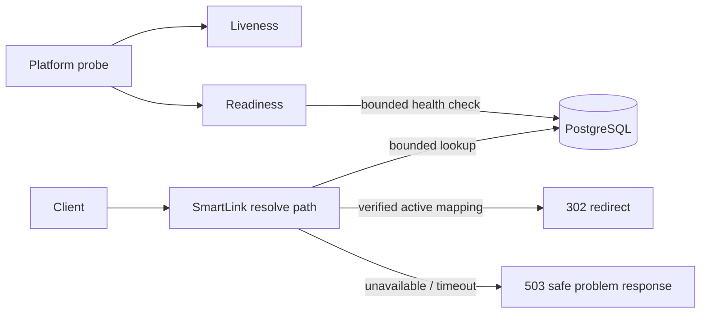

# Scenario 03 — Ambiguous · Engineering Specification

**Original request:** [original-requirement.md](original-requirement.md) — *“Improve reliability.”*
**Requirements baseline:** [clarified-requirements.md](clarified-requirements.md)
**Status:** Planned; implementation starts only after Scenario 02 Gate D and this scenario’s Gate A.

## 1. Purpose and bounded outcome

The original request is not implementable because it names neither a path, a failure mode, a
measure, nor a cost boundary. The approved interpretation is deliberately narrower:

> Improve the reliability posture of the **resolve path** without ever serving a stale or guessed
> destination. Make dependency state observable, bound dependency waits, shut down safely, and
> document measurable operating targets and response procedures.

The outcome is **not** a claim of high availability, a production SLA, or multi-region
resilience. It is a tested, auditable reliability baseline for a single deployable service.

## 2. Constraints and non-goals

| Constraint | Design consequence |
|---|---|
| Correctness beats availability (AS-4) | A missing or unreachable mapping returns `503`; it is never inferred, cached stale, or substituted. |
| One deployment unit (AS-3) | No new infrastructure service, replica topology, load balancer, multi-AZ, or multi-region work. |
| Reliability must be evidenced (AS-5) | Fault injection, health assertions, bounded-time tests, and runbook evidence are mandatory. |
| Existing public behavior is preserved | Known active code → `302`; unknown/malformed code → `404`; unavailable datastore → safe `503`; expired code → `410`. |

Out of scope: read-through cache, circuit breaker, additional retries, bulkheads, load
shedding, database replicas, multi-region failover, rate limiting, and availability guarantees.
The rationale for every deferral is in [clarified-requirements.md](clarified-requirements.md).

## 3. Functional reliability behavior

### 3.1 Health and readiness — R-1

| Endpoint / signal | Semantics | Acceptance rule |
|---|---|---|
| Liveness | The JVM can accept work; it does not depend on PostgreSQL. | A datastore outage must not mark liveness DOWN or trigger a restart loop. |
| Readiness | The service can verify and serve a mapping using its required datastore. | A datastore outage marks readiness DOWN; recovery restores readiness UP. |
| Health detail | Exposed only on the management surface permitted by the existing configuration. | No credentials, connection strings, destination URLs, or stack traces are exposed. |

The readiness probe checks the datastore with an explicit, bounded timeout. The exact local
observation budget is **2 seconds**. This is a prototype acceptance limit, not a production SLO.

### 3.2 Safe dependency failure and time budgets — R-2 and R-3

The resolve path follows this rule:

```text
request → validate code → bounded mapping lookup
  → mapping found: lifecycle check → analytics best-effort → 302
  → mapping absent: 404 LINK_NOT_FOUND
  → mapping unavailable / timeout: 503 SERVICE_UNAVAILABLE
```

Rules:

1. A mapping lookup uses the configured database/connect/query timeout budget.
2. A timeout, connection failure, or transaction-opening failure maps to `503` with the existing
   safe problem response and correlation ID.
3. The service must not redirect from stale, guessed, preloaded, or cache data.
4. Existing bounded retry behavior is retained but not expanded; all attempts must fit inside the
   total dependency budget.
5. Analytics remains fail-open only **after** a verified active mapping is found. It does not make
   a missing mapping or database failure appear successful.

**Prototype budget:** a forced unavailable or slow datastore causes the request to complete with
`503` within **3 seconds** in the local fault-injection test. The value is a guard against an
unbounded wait, not a claim about production latency.

### 3.3 Graceful shutdown — R-4

On a termination signal or orchestrator shutdown request:

1. Readiness becomes DOWN before accepting new application traffic.
2. The server stops accepting new requests.
3. In-flight requests receive a bounded grace period to finish.
4. On grace-period expiry, normal process termination rules apply; no attempt is made to create a
   redirect response from incomplete state.

The prototype grace period is configurable and defaults to **30 seconds**. A deployment
platform is responsible for providing a termination grace period no shorter than the application
budget.

## 4. Observability and operational contract — R-5 and R-6

### 4.1 Signals

| Signal | Definition | Purpose |
|---|---|---|
| Resolve availability SLI | `successful 302 resolutions + expected 404/410 responses` divided by all completed resolve requests, tracked separately from dependency-caused 5xx. | Shows whether valid traffic is being served without counting expected client/product outcomes as service failure. |
| Dependency failure rate | `503 resolve responses / all resolve responses`. | Detects inability to verify mappings. |
| Readiness state | Current readiness and transitions. | Safe traffic-routing signal during dependency loss and deployment. |
| Resolve latency | p50/p95/p99 elapsed time, split by `302`, `404/410`, and `503`. | Detects slow dependency behavior without hiding it in aggregate latency. |
| Analytics write failure count | Best-effort counter update failures after a valid resolution. | Preserves the distinction between product availability and analytics accuracy. |

`4xx` results are not included in the server-error reliability SLI. `404` and `410` are correct
responses for unknown and expired links; treating them as failures would allow scanner traffic to
claim an SLO breach while the service is behaving correctly.

### 4.2 SLO targets

These are **design targets**, not an SLA and not a claim proven on a laptop.

| SLO | Target | Window | Evidence in this prototype |
|---|---:|---|---|
| Resolve availability | ≥ 99.9% of valid resolvable-link requests complete as `302` | 30 days | Definition and measurement method only. |
| Dependency-safe failure | 100% of injected mapping failures return safe `503`, never a redirect | Per test run | Fault-injection test. |
| Readiness recovery | readiness returns UP within 10 seconds after datastore recovery | Per incident | Controlled recovery test. |
| Shutdown behavior | no new work is accepted after readiness DOWN; in-flight work gets ≤30 seconds | Per deploy | Controlled shutdown test. |

### 4.3 Runbook minimum content

| Symptom | First diagnostic action | Escalation / decision |
|---|---|---|
| Readiness DOWN | Inspect database connectivity, timeout metrics, and the correlated dependency-failure logs. | Restore dependency; do not route traffic to unready instance. |
| Resolve `503` increase | Compare dependency failures with latency and pool saturation. | Escalate to datastore owner; do not enable stale cache as an incident workaround. |
| Resolve latency breach | Split latency by outcome and inspect database/query pool health. | Reduce load or restore dependency capacity; defer retry changes until measured. |
| Analytics failures | Inspect warning count and datastore write health. | Preserve redirect service; reconcile analytics only through an approved follow-up process. |
| Shutdown exceeds grace period | Inspect in-flight request duration and platform termination budget. | Adjust configuration only after confirming no request correctness risk. |

## 5. Architecture and configuration changes



- Retain the stateless Spring Boot service and PostgreSQL source of truth.
- Configure connection, query, and health-check timeouts externally.
- Keep liveness independent of the datastore; make readiness dependent on it.
- Enable graceful shutdown and expose only safe management details.
- Do not add a cache, queue, or new service in this scenario.

## 6. Validation strategy

| Requirement | Proof | Level |
|---|---|---|
| R-1 | Simulate datastore unavailable and recovered; assert liveness remains UP and readiness transitions DOWN → UP within bounds. | Integration / fault injection |
| R-2 | Simulate lookup failure; assert `503`, safe body, correlation ID, and absence of `Location`. | API / integration |
| R-3 | Simulate slow dependency beyond configured budget; assert bounded `503` and no request-pool exhaustion in the test workload. | Integration / resilience |
| R-4 | Start an in-flight controlled request, initiate graceful shutdown, assert readiness changes first and no new work is accepted. | Process / integration |
| R-5 | Verify metrics/log fields and document SLI calculations and target-vs-measured distinction. | Documentation / review |
| R-6 | Walk each injected symptom through the runbook; verify links and first actions. | Operational acceptance |

All Scenario 01 and Scenario 02 tests remain regression gates. The test suite must not depend on
wall-clock sleeps for readiness or expiry behavior; controlled fault injectors and timeouts are
used instead.

## 7. Rollback and safety

This scenario is configuration and behavior hardening; it introduces no schema migration.

- Feature/configuration rollback restores the prior timeout and shutdown settings.
- A rollback must not turn off safe `503` handling or reintroduce an unbounded dependency wait.
- If readiness behavior proves too sensitive, adjust only the documented probe timeout/threshold
  after capturing the observed evidence; do not make liveness dependency-sensitive.
- No stale-cache fallback is permitted as a rollback shortcut because it violates AS-4.

## 8. Definition of done

Scenario 3 is complete when R-1 through R-6 are traced to implementation or operational
artifacts; R-1 through R-4 have fault-injection evidence; all quality gates pass; SLO targets are
clearly distinguished from measured facts; the runbook is actionable; and the final summary names
every deferred reliability mechanism and why it was deferred.
