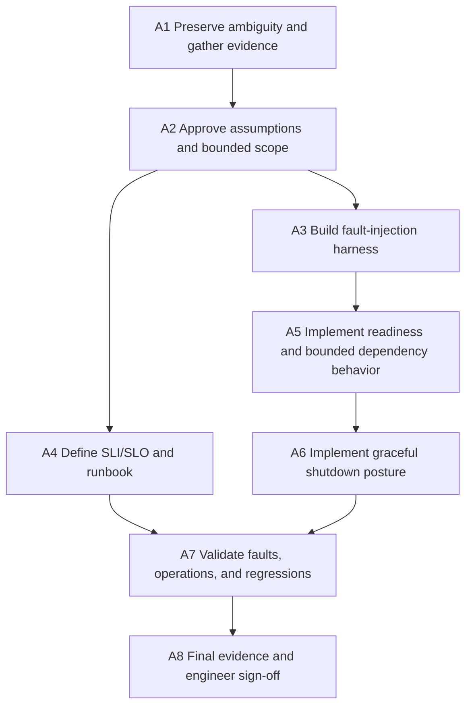

# Scenario 03 — Ambiguous · Task Decomposition

**Scenario:** Ambiguous requirement — reliability
**Original request:** [original-requirement.md](original-requirement.md)
**Requirements baseline:** [clarified-requirements.md](clarified-requirements.md)
**Engineering specification:** [engineering-spec.md](engineering-spec.md)
**Status:** Planned; no implementation has started.

> The key deliverable is the progression from an ambiguous direction to bounded engineering work.
> The AI assistant may help inspect, test, and document tasks, but it may not select the reliability
> target, acceptable failure behavior, or scope boundary.

## 1. Delivery sequence

**Ordering rule:** the fault-injection harness precedes reliability changes. A timeout,
health-check, or shutdown setting that has not been exercised under failure is indistinguishable
from one that does not work.

## 2. Definition of done

Each task is complete only when its acceptance criteria are met, its evidence is recorded in
[validation.md](validation.md), AI-assisted contributions are recorded in
[ai-assisted-engineering.md](../../ai-assisted-engineering.md), and the engineer of record has
approved the result.

## 3. Work items

### A1 — Preserve the original request and establish the reliability baseline

| Field | Detail |
|---|---|
| Intent | Avoid silently turning “Improve reliability” into an engineer’s preferred solution; identify the actual paths, current controls, and evidence gaps. |
| Dependencies | Scenario 02 Gate D. |
| Requirements | Original request; R-1 through R-6. |
| Tasks | Preserve verbatim request; inspect resolve/create/analytics paths, health configuration, timeouts, retry behavior, graceful-shutdown settings, logs, tests, and existing quality evidence. Record baseline facts separately from assumptions. |
| Constraints | No implementation or architecture choice in this task. Do not infer a production incident or traffic level from missing data. |
| Acceptance criteria | The original request, unanswered questions, current facts, and unknowns are separately visible; no scope decision is presented as a fact without evidence. |
| AI assistance allowed | Generate an evidence-collection checklist; engineer verifies every fact in code, configuration, or test output. |
| Evidence | Updated ambiguity record and baseline notes. |

### A2 — Approve assumptions and normalize the requirement

| Field | Detail |
|---|---|
| Intent | Convert the ambiguous request into an approved, bounded requirement with explicit non-goals. |
| Dependencies | A1. |
| Requirements | Q-1 through Q-5, AS-1 through AS-5, R-1 through R-6. |
| Tasks | Review clarification questions; approve or revise assumptions; choose resolve path, correctness-over-availability posture, one-deployment-unit boundary, and evidence requirement; approve deferred mechanisms. |
| Constraints | Do not introduce caching, multi-region, circuit breaking, or extra retries merely because they sound like reliability work. |
| Acceptance criteria | A reviewer can explain why each included control exists and why each deferred mechanism is out of scope. The wording distinguishes an assumption from a confirmed stakeholder answer. |
| AI assistance allowed | Challenge hidden assumptions and propose competing interpretations; engineer decides and records the rationale. |
| Engineer approval | **Gate A:** approve the clarification record, assumptions, bounded interpretation, and deferrals before design or implementation. |
| Evidence | Signed Gate A in clarified requirements; approved engineering specification. |

### A3 — Build the controlled fault-injection and measurement harness

| Field | Detail |
|---|---|
| Intent | Make failure behavior observable and repeatable before modifying reliability controls. |
| Dependencies | A2. |
| Requirements | R-1, R-2, R-3, R-4. |
| Tasks | Create deterministic ways to simulate datastore unavailable, datastore slow beyond budget, recovery, and controlled in-flight work. Capture status, headers, elapsed time, readiness/liveness, and logs/metrics without using wall-clock sleeps as assertions. |
| Constraints | Inject faults only in test/local profiles. Never use a production endpoint, customer data, or uncontrolled network failure as a test mechanism. |
| Acceptance criteria | Each required fault can be triggered repeatably; the harness distinguishes `302`, expected `404/410`, and safe `503`; it can demonstrate recovery. |
| AI assistance allowed | Draft fault matrix and test scaffolding; engineer verifies isolation, deterministic assertions, and failure cleanup. |
| Evidence | Fault-injection test utilities and initial failing/baseline evidence. |

### A4 — Define the SLI/SLO and operational runbook

| Field | Detail |
|---|---|
| Intent | Ensure “reliable” has a measurable operational meaning and that an operator knows what to do when it is not met. |
| Dependencies | A2. |
| Requirements | R-5, R-6. |
| Tasks | Define resolve availability, dependency-failure, readiness, latency, and analytics-write signals; define design SLO targets; write first diagnostic and escalation action for each breach. |
| Constraints | Do not count `404`/`410` as server reliability failures. Do not call a laptop measurement an SLA or production proof. |
| Acceptance criteria | Every SLO has an SLI, window, target, collection method, and clear label as target versus measured evidence; every breach has a first action and escalation. |
| AI assistance allowed | Review metric definitions for ambiguity; engineer validates semantics against public HTTP behavior. |
| Evidence | SLO table and runbook in engineering spec/final documentation. |

### A5 — Implement readiness and bounded dependency behavior

| Field | Detail |
|---|---|
| Intent | Make the service route-safe during datastore failure and ensure a slow dependency cannot hold requests indefinitely. |
| Dependencies | A3, A4. |
| Requirements | R-1, R-2, R-3. |
| Tasks | Configure explicit connection/query/health budgets; separate liveness from readiness; map timeout/unavailability to safe `503`; ensure existing retries fit the total budget; expose only safe health detail. |
| Constraints | No stale fallback; no new retry loop; no liveness failure due solely to dependency outage; do not disclose connection details or destination URLs. |
| Acceptance criteria | Injected unavailable dependency causes readiness DOWN and safe `503`; liveness stays UP; injected slow dependency completes within the defined budget; recovery returns readiness UP within its target. |
| AI assistance allowed | Suggest configuration and negative test cases; engineer verifies each setting is supported by the selected framework/library and that total time is bounded. |
| Engineer approval | Confirm correctness-over-availability is preserved: an unavailable mapping never turns into a redirect. |
| Evidence | Fault-injection results, health/API tests, configuration review. |

### A6 — Implement and validate graceful shutdown

| Field | Detail |
|---|---|
| Intent | Make deployments and terminations stop accepting new work while allowing bounded in-flight work to finish. |
| Dependencies | A3, A5. |
| Requirements | R-4. |
| Tasks | Configure graceful shutdown and readiness transition; document application and platform grace-period relationship; add controlled shutdown test. |
| Constraints | Do not accept fresh traffic after readiness is DOWN; do not exceed the platform’s termination budget; do not claim zero dropped requests without evidence. |
| Acceptance criteria | During a controlled shutdown, readiness changes before new work is accepted; an in-flight permitted request completes within grace; new requests are rejected or not routed according to the documented behavior. |
| AI assistance allowed | Draft test sequence and documentation; engineer verifies against actual runtime behavior. |
| Evidence | Controlled shutdown transcript/test, configuration values, deployment note. |

### A7 — Run regression, resilience, security, and documentation validation

| Field | Detail |
|---|---|
| Intent | Prove new reliability controls preserve the existing URL-shortener contracts and do not create unsafe failure paths. |
| Dependencies | A4, A5, A6. |
| Requirements | R-1 through R-6; Scenario 01/02 regression contracts. |
| Tasks | Run unit, integration, API contract, fault-injection, performance-method, secret/dependency/static-analysis checks; populate validation matrix; perform runbook walkthrough. |
| Constraints | A test that passes only while the dependency is healthy is not resilience evidence. Treat any changed Greenfield/Brownfield test as a behavior change requiring documented rationale. |
| Acceptance criteria | Existing active/unknown/expired redirect contracts still hold; no unresolved high-severity security finding; all fault scenarios have observed results; SLO claims match evidence. |
| AI assistance allowed | Summarize reports and identify evidence gaps; engineer reviews every finding and every waiver. |
| Evidence | Quality-gate reports, completed validation document, runbook walkthrough. |

### A8 — Finalize the ambiguous-scenario engineering summary

| Field | Detail |
|---|---|
| Intent | Present a reviewer with the complete reasoning chain from ambiguity through approved scope, implementation, validation, and known limits. |
| Dependencies | A7. |
| Requirements | Final engineering summary deliverable; R-1 through R-6. |
| Tasks | Update README, architecture overview, final summary, decision log, scenario validation, and AI ledger. State what was built, measured, assumed, deferred, and not proven. |
| Constraints | Documentation may not represent planned architecture as implemented or SLO targets as achieved SLAs. It may not depend on Git history to explain the scenario. |
| Acceptance criteria | A reviewer can trace each scenario requirement to evidence, see the rejected interpretations, reproduce local checks, and understand the limits of the reliability claim. |
| AI assistance allowed | Documentation review only; engineer verifies every command and claim. |
| Engineer approval | **Gate D:** confirm code is reviewed, quality gates are green, evidence is complete, and the scenario’s limits are candid. |
| Evidence | Final engineering summary and signed Gate D. |

## 4. Parallelization guidance

| Parallel work | Constraint |
|---|---|
| A3 fault harness and A4 SLI/runbook design | Both follow approved scope in A2. Measurement definitions must not be changed merely to make a test pass. |
| Documentation skeleton | May start after A2, but all claims are validated only in A8. |
| Security/static-analysis setup | May begin after A2; conclusions wait for the implemented behavior in A7. |

## 5. Requirement coverage

| Requirement | Task(s) |
|---|---|
| R-1 Readiness | A3, A5, A7 |
| R-2 Safe resolve failure | A3, A5, A7 |
| R-3 Explicit timeouts | A3, A5, A7 |
| R-4 Graceful shutdown | A3, A6, A7 |
| R-5 SLI/SLO | A4, A7, A8 |
| R-6 Runbook | A4, A7, A8 |

## 6. AI traceability template

| Task | Task envelope supplied to AI | Output used | Engineer edit/rejection | Validation | Approval |
|---|---|---|---|---|---|
| Example: A5 timeout design | Preserve safe `503`; no stale fallback; all attempts inside a 3-second local budget; no new retry loop. | Fault-case checklist. | Rejected a cache fallback; contradicts AS-4. | Fault injection verifies no redirect when datastore is unavailable. | Engineer approved. |

Every material entry is classified `GENERATED`, `EDITED`, or `REJECTED` in the repository
ledger. The accepted code or document is never evidence by itself; the linked validation is.
